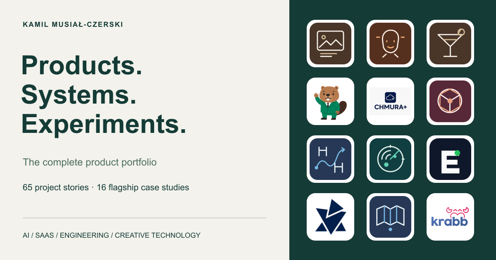

# Product portfolio

**[Explore the live portfolio →](https://kamio90.github.io/kamio90/portfolio/)**

A complete collection of products, prototypes and technical experiments by Kamil Musiał-Czerski. Related repositories are presented as one product story.

## Flagship projects

| Project | What it explores | Status |
| --- | --- | --- |
| [AI Alt Text Generator](cases/ai-alt-text-generator.md) | Image descriptions, reviewed where you manage your media. | Implemented plugin |
| [Avatar Engine](cases/avatar-engine.md) | Build conversational experiences around knowledge and workflows. | Development prototype |
| [BarMate](cases/barmate.md) | A private, on-device assistant for a home bar. | Native mobile prototype |
| [Beaver Educator — Retirement Simulator](cases/beaver-educator.md) | Explore retirement scenarios through a guided, visual experience. | HackYeah 2025 prototype for the ZUS challenge. It is an educational simulator, not an official benefit decision system. |
| [CHMURA+](cases/chmura-plus.md) | Turn point clouds into understandable infrastructure. | Hackathon prototype |
| [CIRCLE EDGE](cases/circle-edge.md) | Connect local learning, opportunities and community participation. | HackYeah 2023 prototype; first-place PFR challenge result was established in the existing LinkedIn project. |
| [CourseDesigner](cases/course-designer.md) | An interactive workspace for equestrian course design. | Interactive frontend prototype. The inspected repository uses a fake API; cloud persistence and production authentication are not established. Local preview on 2026-09-25 was blocked by a duplicate state declaration in TopBar.tsx. |
| [DotRadar](cases/dotradar.md) | Make scattered grant information searchable and actionable. | SaaS in development |
| [EquiBrain](cases/equibrain.md) | Bring equestrian-centre operations into one workspace. | SaaS in development |
| [ISS Lookout](cases/iss-lookout.md) | Explore the International Space Station in a 3D solar-system experience. | NASA Space Apps Challenge 2022 prototype; current public deployment not verified. |
| [KMC Studio Hub](cases/kmc-studio-hub.md) | A shared home for knowledge products and advisory services. | Platform in development |
| [KRABB](cases/krabb.md) | A modern grocery-commerce platform with operational depth. | Client delivery |
| [Meta Agent AI](cases/meta-agent-ai.md) | Turn discovery conversations into reviewable software artifacts. | Development prototype |
| [Newsmap](cases/newsmap.md) | Make interactive maps easier to navigate and operate. | Client delivery |
| [Renewable Energy Sales Operations](cases/confidential-energy-operations.md) | Connecting sales leads, offers and delivery workflows. | Archived implementation; current deployment unverified |
| [WooCommerce AI Product Descriptions](cases/woocommerce-ai-product-descriptions.md) | Product copy assistance inside the WooCommerce editor. | Implemented plugin |

## Strong projects

| Project | What it explores | Status |
| --- | --- | --- |
| [Aider Launcher](cases/aider-launcher.md) | Local coding assistants with a native macOS front door. | Desktop utility |
| [CO2UNTER](cases/co2unter.md) | Translate everyday emissions into urban-greenery comparisons. | HackYeah 2024 prototype with illustrative coefficients; not a certified emissions-accounting system. |
| [Confidential Enterprise Transformation](cases/confidential-enterprise.md) | Engineering confidential business software with controlled delivery. | Confidential client delivery |
| [Conversational Travel Demo](cases/avatar-travel-demo.md) | A travel conversation that changes the interface as it unfolds. | Interactive demonstration |
| [EnergoID](cases/energoid.md) | Explore a connected data foundation for energy services. | Energy-data prototype |
| [Event Photo Gallery](cases/event-photo-gallery.md) | A simple shared photo collection for a live event. | Personal event application |
| [Event RSVP Platform](cases/event-rsvp.md) | Personalized invitations with an organizer workspace. | Personal event application |
| [FileFluent](cases/filefluent.md) | Turn administrative PDF text into structured metadata. | Archived prototype. The parser currently reads a fixed sample PDF; general uploaded-document processing is not established. |
| [Financial Services Website](cases/confidential-financial-website.md) | Making a broad financial-services offer easier to explore. | Archived client implementation |
| [Freelance Opportunity Desk](cases/freelance-opportunity-desk.md) | Turn unstructured project offers into a usable pipeline. | Workflow prototype |
| [Gemini Drawing Game API](cases/gemini-drawing-game.md) | A generative-AI backend for drawing-based game interactions. | Archived Gemini hackathon prototype; no live demo or production readiness verified. |
| [ITRoom Digital Studio](cases/itroom-digital-studio.md) | A studio identity expressed through interactive web design. | Archived website iterations |
| [Kamil Musiał Engineering Studio](cases/engineering-studio.md) | An engineering practice presented as an interactive product. | Portfolio website |
| [KMES Autopilot](cases/kmes-autopilot.md) | A designed workspace for coordinated coding agents. | Architecture concept |
| [Lead Operations Workbench](cases/lead-operations.md) | Keep research, enrichment and follow-up preparation in one process. | Internal workflow tool |
| [Link Management Service](cases/link-management.md) | Short links with ownership, expiry and cached redirects. | Implemented prototype; public deployment, load capacity and production security have not been verified in this review. |
| [MDE Core — Technical Review](cases/mde-core-review.md) | Separate demonstrated AI behaviour from architectural claims. | Technical review |
| [Municipal News Intelligence](cases/municipal-news-intelligence.md) | Collect local updates and classify them on your own machine. | Implemented CLI |
| [Particle Hand AI](cases/particle-hand-ai.md) | Move a particle field with your hands. | Creative technology prototype |
| [Prione](cases/prione.md) | Narrative systems and visual tooling inside a Unity world. | Archived game prototype |
| [Research Collaboration — NASA Space Apps 2023](cases/research-collaboration-nasa2023.md) | A backend for discovering and organizing research collaboration. | Archived NASA Space Apps 2023 backend prototype; frontend and public deployment not verified in this repository. |
| [Rico AI](cases/rico-ai.md) | A workspace for exploring connected construction workflows. | Development prototype |
| [Seniorzy — Voice Booking Concept](cases/seniorzy.md) | Explore appointment navigation through a guided conversation. | Interaction concept |
| [SoCap Avatar AI](cases/socap-avatar-ai.md) | A conversational front end for a domain calculator. | Client prototype |
| [Spaceflight Portfolio](cases/spaceflight-portfolio.md) | Navigate a career portfolio as a spaceflight experience. | Implemented interactive prototype; current public deployment is not verified. |
| [Subscription AI Assistant](cases/subscription-ai-assistant.md) | An authenticated AI assistant with subscription-based access. | Archived prototype. Subscription access checks exist; production billing, paid customers and deployment are not verified. |
| [Sustainable Infrastructure Website](cases/confidential-infrastructure-website.md) | A clear digital front door for environmental infrastructure services. | Archived client websites |
| [Web Game Engine](cases/web-game-engine.md) | A typed runtime foundation for browser-based worlds. | Engine foundation |
| [Zdzisek Voice Translator](cases/zdzisek-voice-translator.md) | Speech in, translated speech out. | Archived AI integration experiment |

## Portfolio archive

| Project | What it explores | Status |
| --- | --- | --- |
| [Advent Calendar](cases/advent-calendar.md) | A small seasonal experience with persistent daily discoveries. | Interactive experience |
| [CMS Domain Model](cases/cms-domain-model.md) | Modelling the building blocks of managed content. | Archived domain-model prototype; operational services incomplete |
| [Crap RTS — 3D Scene Foundation](cases/crap-rts.md) | A Three.js scene foundation for a browser strategy-game concept. | Archived rendering experiment; RTS gameplay is not implemented in the inspected source. |
| [Crypto Market Dashboard](cases/crypto-market-dashboard.md) | Sortable cryptocurrency data and drill-down views. | Archived UI prototype using bundled JSON snapshots; no live feed verified. |
| [Gaussian Rendering Lab](cases/gaussian-rendering-lab.md) | A C# exploration of Gaussian data, rendering and deformation. | Early archived experiment. It is not a validated Gaussian-splatting reconstruction system or trained deformation model. |
| [GodEye — Camera Interface Experiment](cases/godeye.md) | A webcam interface with lightweight image-analysis experiments. | Archived experiment; the heuristic is not validated face recognition or identity verification. |
| [Health Assistant — Mobile UI Concept](cases/health-assistant-mobile.md) | A mobile onboarding foundation for a health-assistant concept. | Archived mobile UI foundation. No diagnostic model, symptom assessment, medical validation or backend authentication is implemented in the reviewed flow. |
| [Image Feature Template Lab](cases/image-feature-template-lab.md) | Browser-based image preprocessing and template generation. | Archived technical prototype; identity-recognition accuracy and production deployment are not established. |
| [Jarvis — NLP Command API](cases/jarvis-command-api.md) | A lightweight natural-language command endpoint. | Archived proof of concept supporting a small set of rule-based phrases; no autonomous task execution verified. |
| [Neighbourhood Listings API](cases/neighbourhood-api.md) | A typed backend for local service listings. | Archived backend prototype |
| [NoteAPI](cases/note-api.md) | Account-linked text records through a compact REST API. | Archived API prototype |
| [Personal Start Page](cases/personal-start-page.md) | A quiet browser home screen with a live clock. | Archived personal utility |
| [Prione WebGL Engine](cases/prione-webgl.md) | A small browser rendering engine built directly on WebGL. | Archived technical experiment; not a complete game engine. |
| [SheepYourHack Communication Backend](cases/sheepyourhack-communication.md) | A backend foundation for text and voice communication experiments. | Archived partial hackathon prototype |
| [Social Feed Prototype](cases/social-feed-prototype.md) | Exploring a social product from API to interface. | Archived partial prototype |
| [Streaming Platform Domain Model](cases/streaming-domain-model.md) | Structuring accounts, transmissions and conversation data. | Archived domain-model prototype; operational services incomplete |
| [Task List Interaction Prototype](cases/task-list-interactions.md) | A focused exploration of sortable task-list interactions. | Small archived UI experiment; no server-side task persistence verified. |
| [Virtual Fitting Lab](cases/virtual-fitting-lab.md) | Explore the interaction path from a photo to a 3D preview. | Interaction prototype |
| [Void — Interactive Environment Experiment](cases/void-interactive-environment.md) | Exploring movement and presentation in a real-time environment. | Archived technical experiment |
| [Wheelchair BrainWaves — Architecture Concept](cases/wheelchair-brainwaves.md) | A modular architecture exploration for assistive mobility. | Architecture concept and software scaffold only. Hardware control, EEG interpretation and deployed assistive-device operation are not verified. |

Confidential client work uses neutral descriptions and identities. Private repositories are not linked. New portfolio graphics are editorial presentations, not claims of historical client branding.
