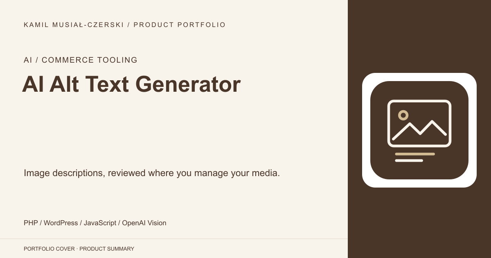
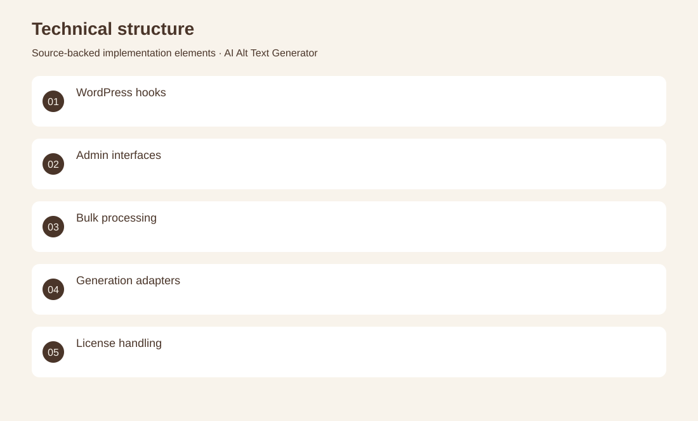
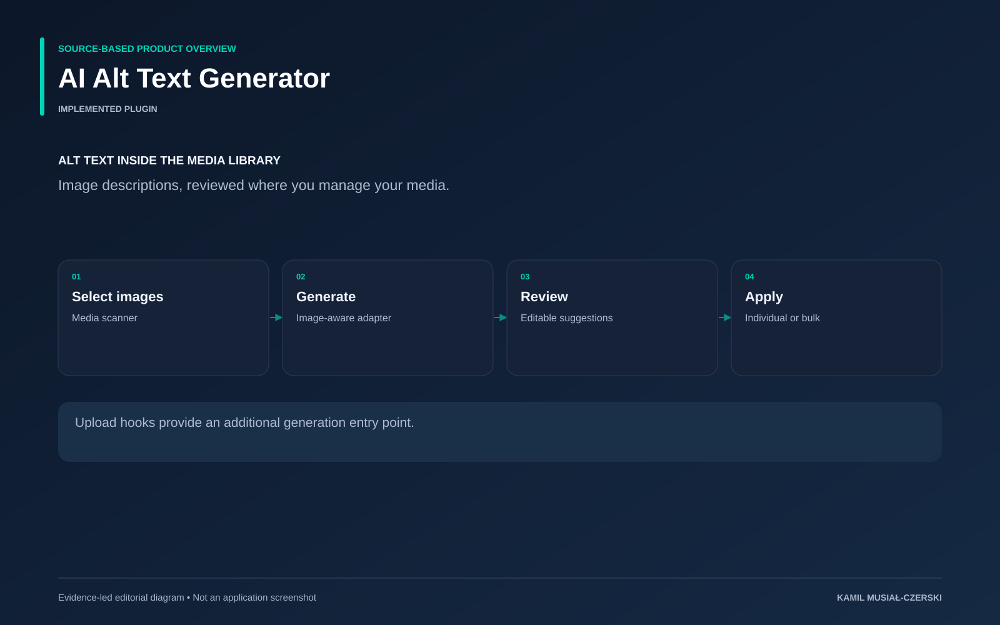

# AI Alt Text Generator

Image descriptions, reviewed where you manage your media.

**AI / Commerce tooling · Implemented plugin**

The plugin works inside the WordPress media library, turning selected images into editable alternative-text suggestions. A media scanner, generation adapter and administrator interface support individual and bulk workflows, while upload hooks provide an automatic entry point.

## Problem

Media libraries accumulate images without useful alternative text.

## Solution

A native editorial workflow lets users select images, request descriptions and review generated text.

## My contribution

Implemented the media scanner, image-generation adapter, bulk review interface and upload-triggered generation hooks.

## Technology

PHP; WordPress; JavaScript; OpenAI Vision

## Technical structure

WordPress hooks; Admin interfaces; Bulk processing; Generation adapters; License handling

## AI capabilities

Vision-assisted image descriptions; Bulk alternative-text generation

## Visuals

Portfolio cover and new project marks are editorial artwork. Only product views explicitly identified as captures represent screenshots.

[Complete portfolio](../README.md)

