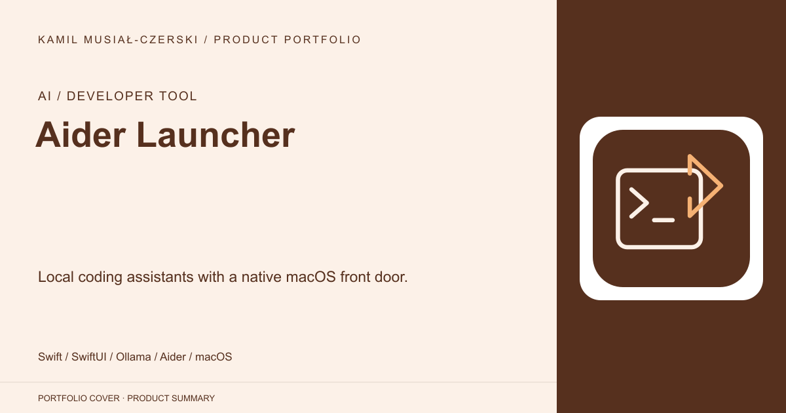
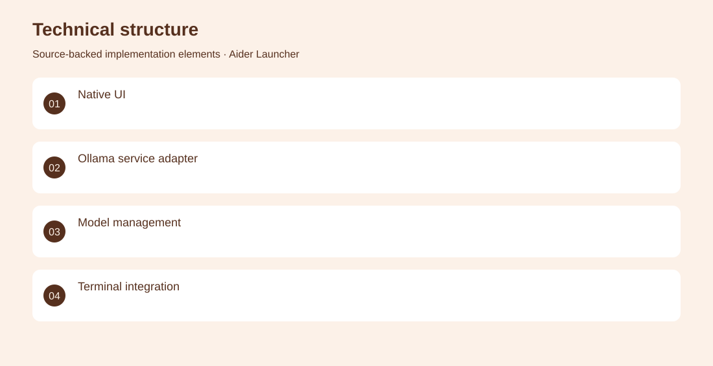
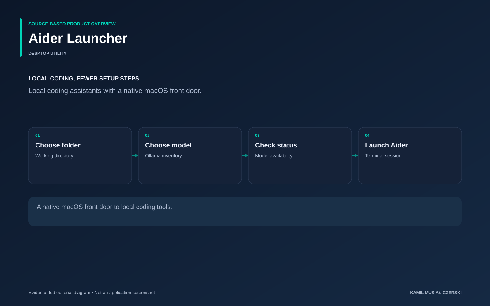

# Aider Launcher

Local coding assistants with a native macOS front door.

**AI / Developer tool · Desktop utility**

A SwiftUI application wraps model discovery, persisted settings and terminal launch services. Implemented the SwiftUI launcher, model-management services and terminal integration for local coding tools.

## Problem

Launching local coding models involves repeated command-line setup and model configuration.

## Solution

A SwiftUI application wraps model discovery, persisted settings and terminal launch services.

## My contribution

Implemented the SwiftUI launcher, model-management services and terminal integration for local coding tools.

## Technology

Swift; SwiftUI; Ollama; Aider; macOS

## Technical structure

Native UI; Ollama service adapter; Model management; Terminal integration

## AI capabilities

Local coding-model orchestration

## Visuals

Portfolio cover and new project marks are editorial artwork. Only product views explicitly identified as captures represent screenshots.

[Complete portfolio](../README.md)

