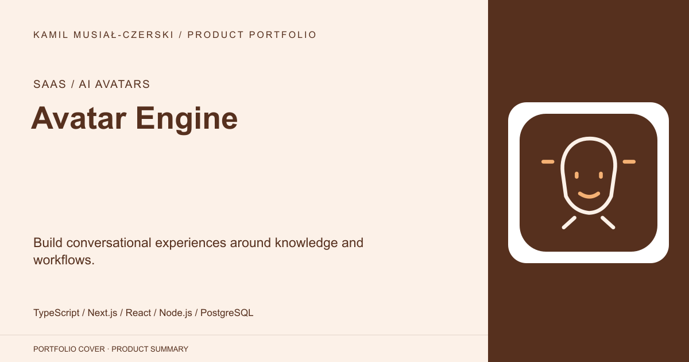
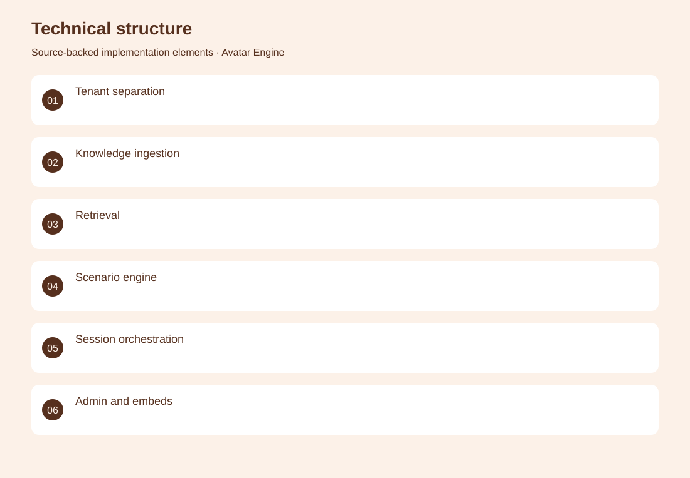
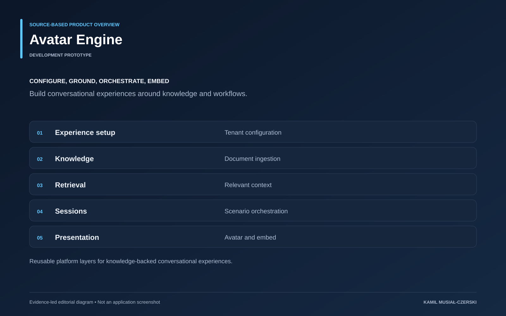

# Avatar Engine

Build conversational experiences around knowledge and workflows.

**SaaS / AI avatars · Development prototype**

Tenant configuration defines each experience, while separate services handle document ingestion, retrieval and session execution. The administration interface exposes scenario and knowledge configuration, and embedded experiences deliver the conversational interface. The result is a reusable development platform rather than a collection of isolated avatar demos.

## Problem

Organizations need repeatable ways to configure knowledge-backed conversational interfaces.

## Solution

The platform separates tenant configuration, retrieval, session orchestration and presentation.

## My contribution

Connected tenant configuration, knowledge ingestion, scenario execution and embeddable avatar experiences.

## Technology

TypeScript; Next.js; React; Node.js; PostgreSQL; Supabase; Anam

## Technical structure

Tenant separation; Knowledge ingestion; Retrieval; Scenario engine; Session orchestration; Admin and embeds

## AI capabilities

Retrieval-augmented generation; Conversational avatars; Scenario orchestration

## Visuals

Portfolio cover and new project marks are editorial artwork. Only product views explicitly identified as captures represent screenshots.

[Complete portfolio](../README.md)

