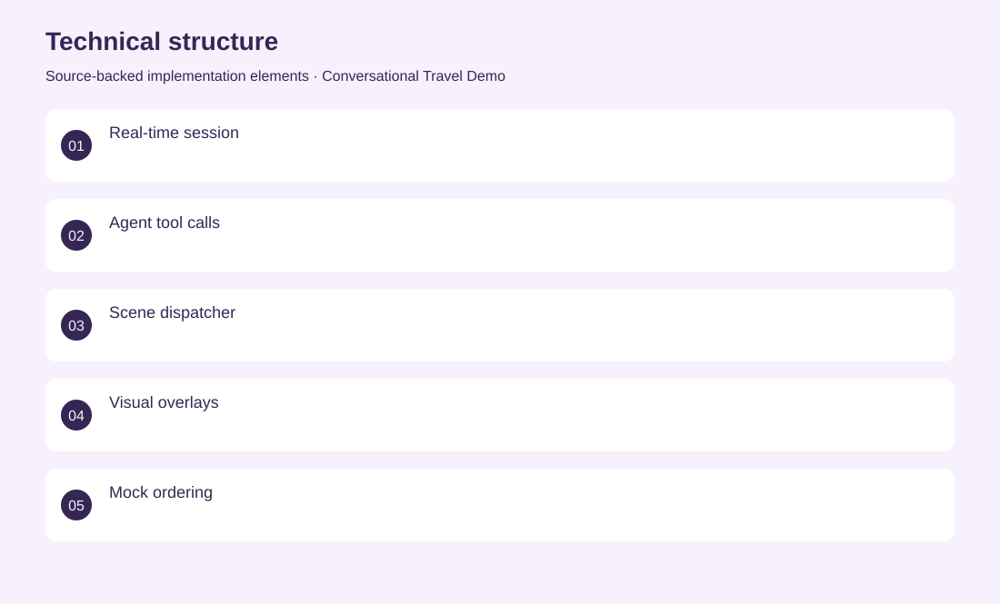
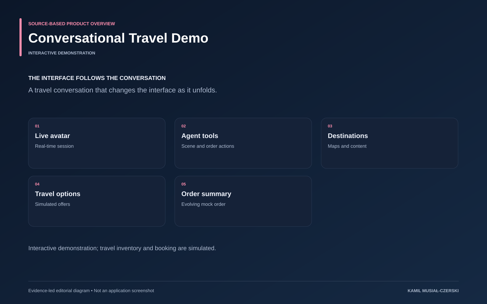

# Conversational Travel Demo

A travel conversation that changes the interface as it unfolds.

**AI / Interactive prototype · Interactive demonstration**

Agent tools dispatch scene and order changes into a visual frontend through real-time communication. Implemented agent scene tools, visual overlays and simulated order updates for a conversational travel demonstration.

## Problem

Voice demos are more understandable when the surrounding interface reflects the conversation.

## Solution

Agent tools dispatch scene and order changes into a visual frontend through real-time communication.

## My contribution

Implemented agent scene tools, visual overlays and simulated order updates for a conversational travel demonstration.

## Technology

TypeScript; Python; Next.js; LiveKit; Anam; Recharts

## Technical structure

Real-time session; Agent tool calls; Scene dispatcher; Visual overlays; Mock ordering

## AI capabilities

Conversational avatar; Tool-driven UI changes

## Visuals

Portfolio cover and new project marks are editorial artwork. Only product views explicitly identified as captures represent screenshots.

[Complete portfolio](../README.md)

