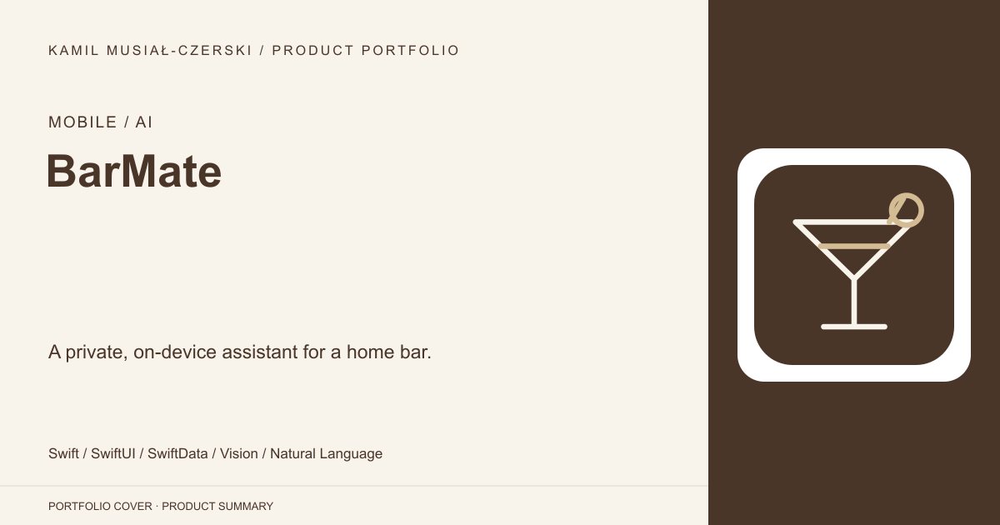
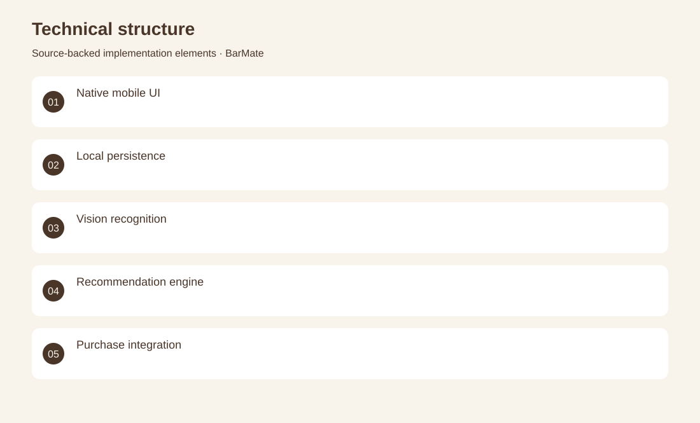
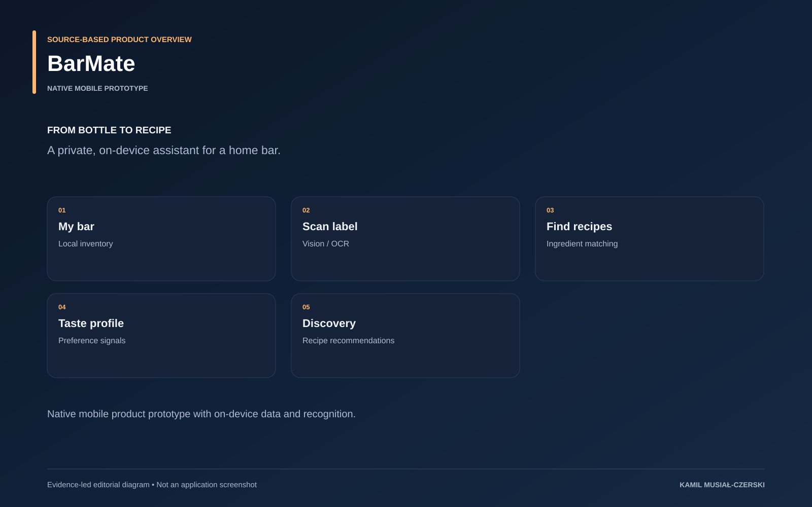

# BarMate

A private, on-device assistant for a home bar.

**Mobile / AI · Native mobile prototype**

The native application treats inventory, recognition and recipe selection as a single product flow. Local data models retain bottles and preferences, while recognition services and the recommendation engine help turn available ingredients into relevant suggestions. Reusable SwiftUI components provide a consistent interface across those tasks.

## Problem

People need recipe suggestions that reflect ingredients they actually have and their preferences.

## Solution

SwiftUI screens and local data models connect Vision-based recognition to a cocktail recommendation engine.

## My contribution

Implemented native inventory and discovery workflows, local recognition services and recommendation logic.

## Technology

Swift; SwiftUI; SwiftData; Vision; Natural Language; StoreKit; React Native; Expo; TypeScript; SQLite; ML Kit

## Technical structure

Native mobile UI; Local persistence; Vision recognition; Recommendation engine; Purchase integration; Native UI; Inventory models; Recognition services; Recipe engine; Store services; Camera capture; OCR classification; Local database; Recipe matching

## AI capabilities

Bottle text recognition; Local classification; Preference-based recommendation

## Visuals

Portfolio cover and new project marks are editorial artwork. Only product views explicitly identified as captures represent screenshots.

[Complete portfolio](../README.md)

