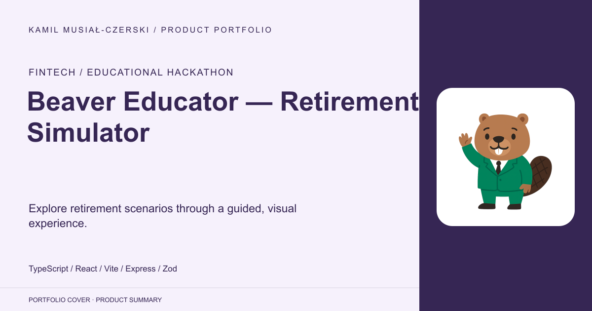
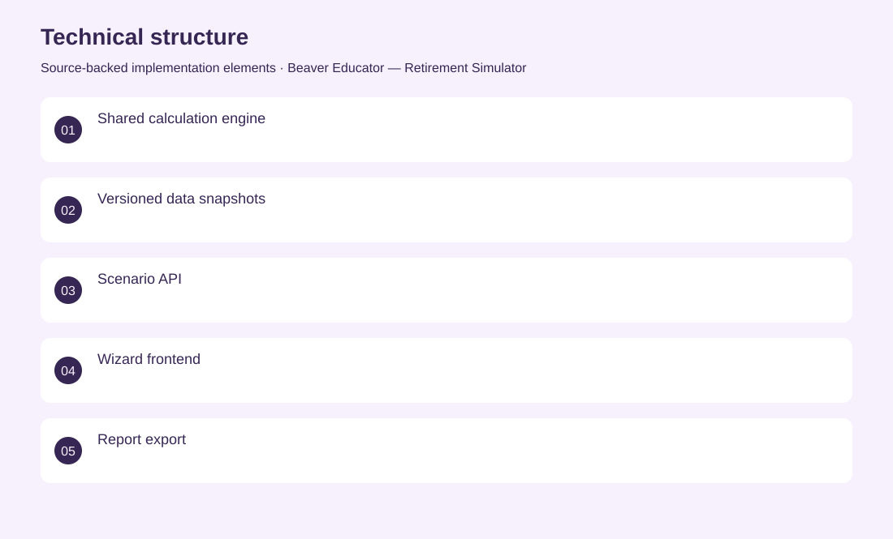
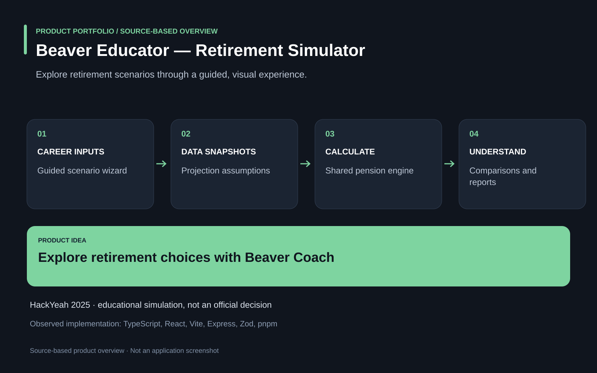

# Beaver Educator — Retirement Simulator

Explore retirement scenarios through a guided, visual experience.

**Fintech / educational hackathon · HackYeah 2025 prototype for the ZUS challenge. It is an educational simulator, not an official benefit decision system.**

Retirement projections are difficult to understand when contribution choices and long-term assumptions remain hidden.

A guided simulator connects career and contribution scenarios with a shared calculation engine, data snapshots, comparisons and downloadable reports. Co-developed the TypeScript monorepo, calculation and API workflows, and an educational frontend with the Beaver Coach character.

HackYeah 2025 prototype for the ZUS challenge. It is an educational simulator, not an official benefit decision system.

## Problem

Retirement projections are difficult to understand when contribution choices and long-term assumptions remain hidden.

## Solution

A guided simulator connects career and contribution scenarios with a shared calculation engine, data snapshots, comparisons and downloadable reports.

## My contribution

Co-developed the TypeScript monorepo, calculation and API workflows, and an educational frontend with the Beaver Coach character.

## Technology

TypeScript; React; Vite; Express; Zod; pnpm; Tailwind CSS

## Technical structure

Shared calculation engine; Versioned data snapshots; Scenario API; Wizard frontend; Report export

## Visuals

Portfolio cover and new project marks are editorial artwork. Only product views explicitly identified as captures represent screenshots.

[Complete portfolio](../README.md)

