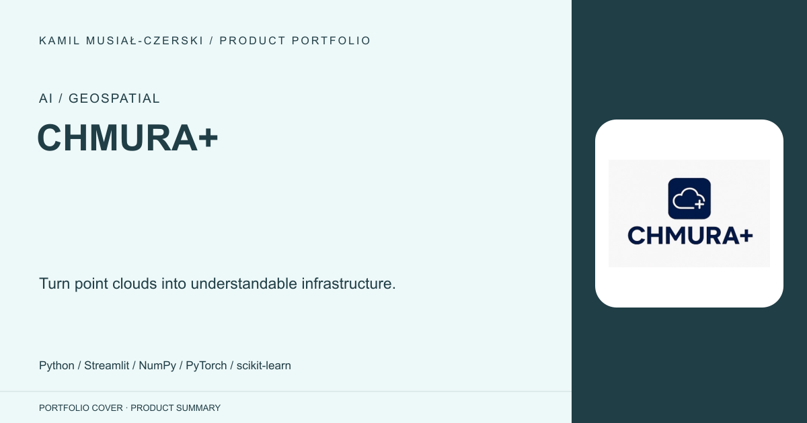
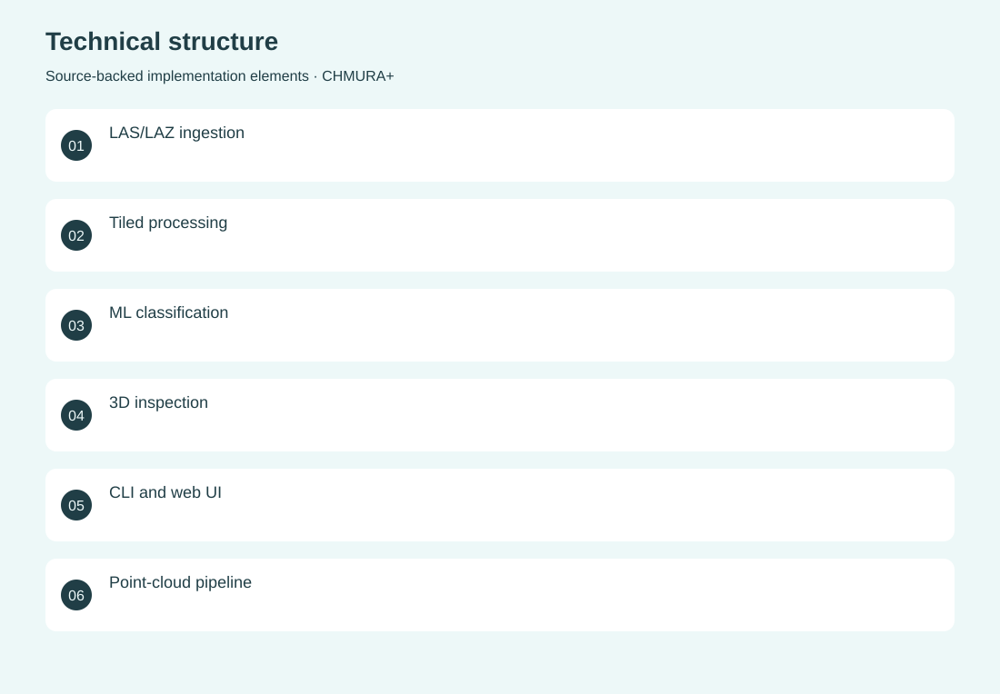
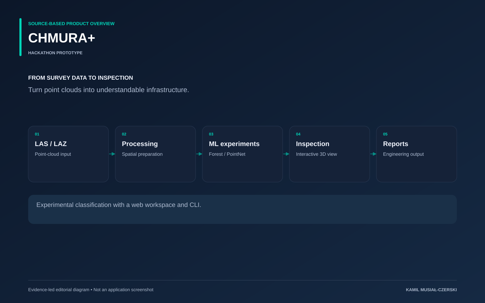

# CHMURA+

Turn point clouds into understandable infrastructure.

**AI / Geospatial · Hackathon prototype**

The prototype exposes the same processing capabilities through a visual workspace and a command-line interface. Its pipeline handles LAS/LAZ inputs, spatial processing and experimental classifiers, then returns inspection views and reports. This makes the relationship between raw survey data and derived infrastructure information visible during a time-constrained hackathon demonstration.

## Problem

Raw point clouds are difficult to inspect and translate into useful engineering information.

## Solution

A Streamlit interface and CLI expose classification, visualization and report generation.

## My contribution

Contributed to the point-cloud processing pipeline, interactive analysis interface and hackathon demonstration.

## Technology

Python; Streamlit; NumPy; PyTorch; scikit-learn; Plotly; Docker

## Technical structure

LAS/LAZ ingestion; Tiled processing; ML classification; 3D inspection; CLI and web UI; Point-cloud pipeline; CLI; Web UI

## AI capabilities

Point-cloud classification; Random Forest and PointNet experiments

## Visuals

Portfolio cover and new project marks are editorial artwork. Only product views explicitly identified as captures represent screenshots.

[Complete portfolio](../README.md)

