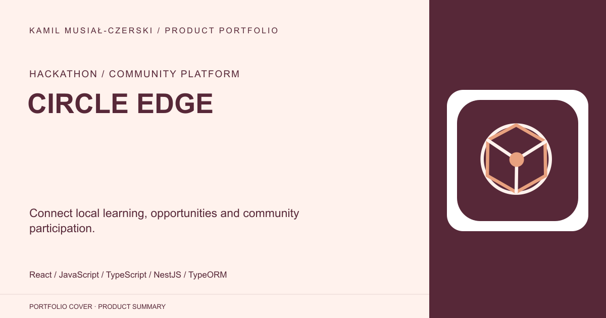
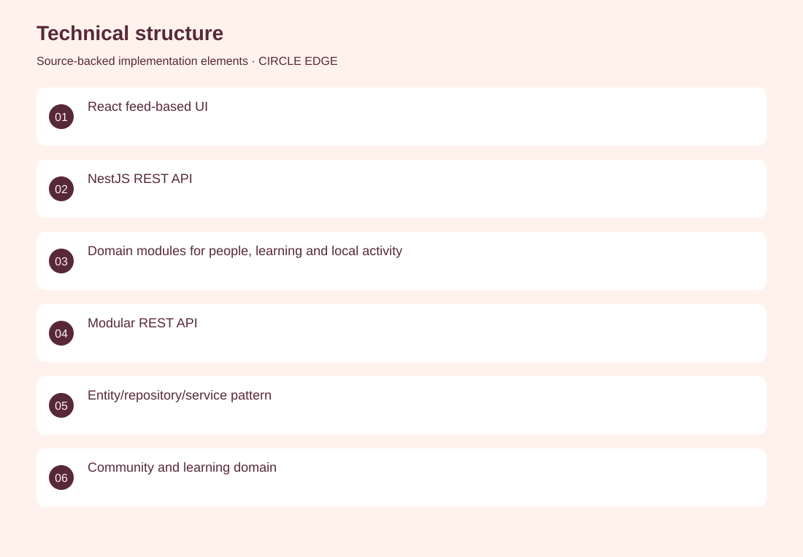
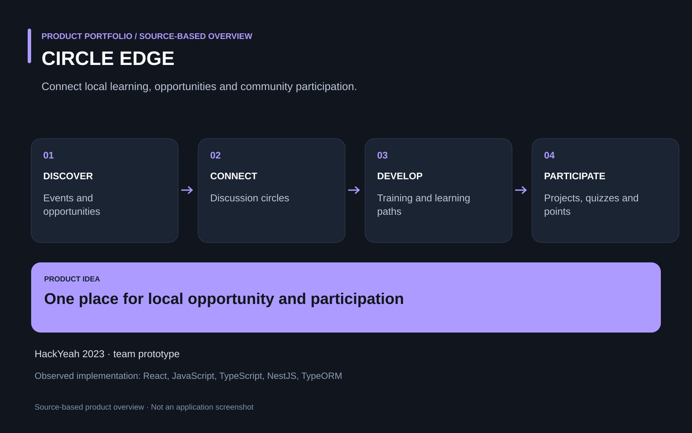

# CIRCLE EDGE

Connect local learning, opportunities and community participation.

**Hackathon / community platform · HackYeah 2023 prototype; first-place PFR challenge result was established in the existing LinkedIn project.**

Local opportunities, training and community activity are often fragmented across separate channels.

A hackathon platform brings together events, job opportunities, projects, quizzes, discussions and development paths in one web experience. Co-developed the application with the team, contributing to the integrated frontend and data-driven product experience.

HackYeah 2023 prototype; first-place PFR challenge result was established in the existing LinkedIn project.

## Problem

Local opportunities, training and community activity are often fragmented across separate channels.

## Solution

A hackathon platform brings together events, job opportunities, projects, quizzes, discussions and development paths in one web experience.

## My contribution

Co-developed the application with the team, contributing to the integrated frontend and data-driven product experience.

## Technology

React; JavaScript; TypeScript; NestJS; TypeORM; Node.js

## Technical structure

React feed-based UI; NestJS REST API; Domain modules for people, learning and local activity; Modular REST API; Entity/repository/service pattern; Community and learning domain

## Visuals

Portfolio cover and new project marks are editorial artwork. Only product views explicitly identified as captures represent screenshots.

[Complete portfolio](../README.md)

