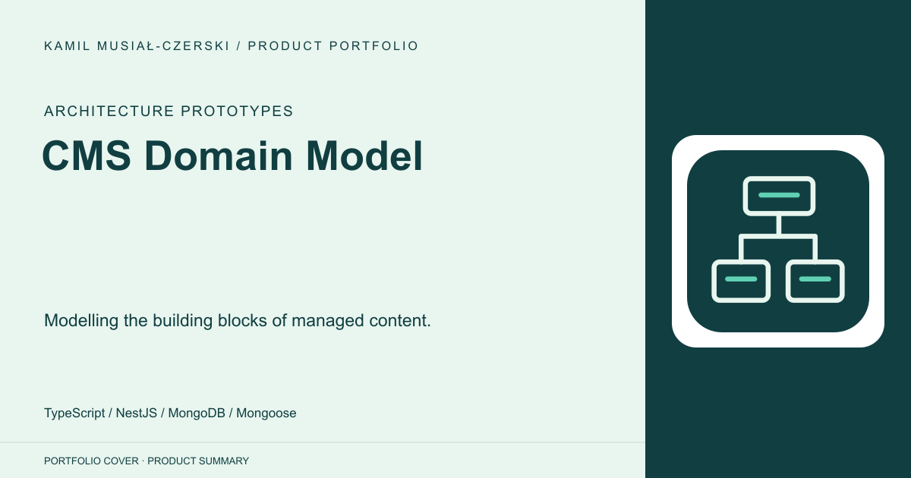
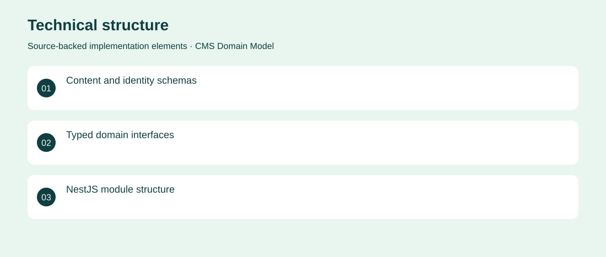

# CMS Domain Model

Modelling the building blocks of managed content.

**Architecture Prototypes · Archived domain-model prototype; operational services incomplete**

An early content-management architecture prototype defining pages, posts, elements, pictures, roles and users. Custom data schemas and typed interfaces establish the domain model; the admin endpoints remain stubs. Defined content schemas and interfaces inside a modular NestJS backend.

## Problem

Content systems need a coherent relationship between page structure, media and user roles.

## Solution

Defined content schemas and interfaces inside a modular NestJS backend.

## My contribution

Early architecture and data-modelling work represented in the repository; individual authorship and completed application delivery are not inferred.

## Technology

TypeScript; NestJS; MongoDB; Mongoose

## Technical structure

Content and identity schemas; Typed domain interfaces; NestJS module structure

## Visuals

Portfolio cover and new project marks are editorial artwork. Only product views explicitly identified as captures represent screenshots.

[Complete portfolio](../README.md)
