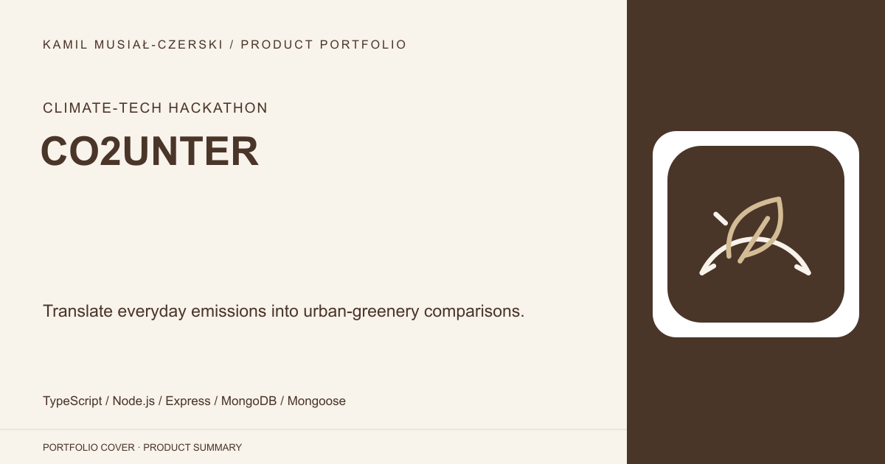
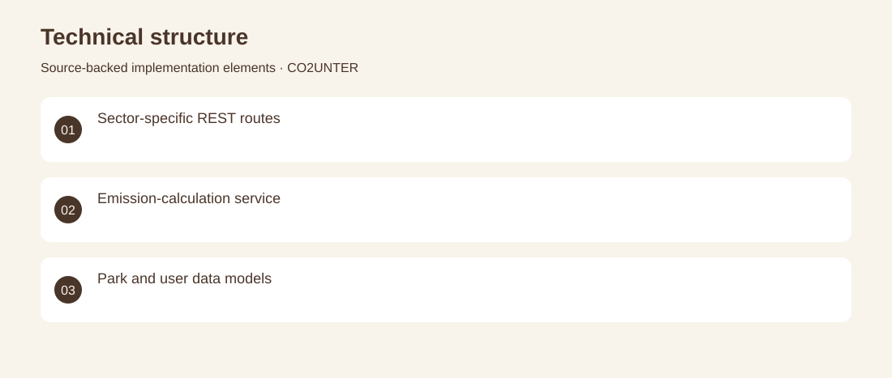
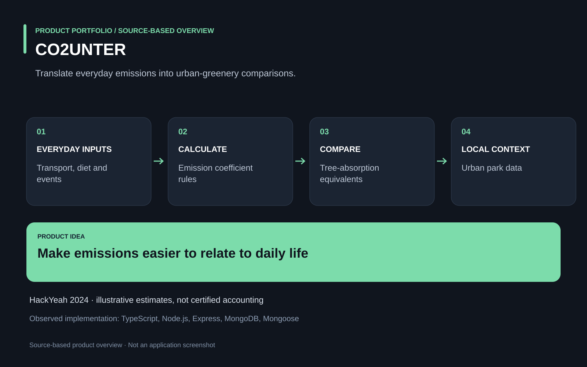

# CO2UNTER

Translate everyday emissions into urban-greenery comparisons.

**Climate-tech hackathon · HackYeah 2024 prototype with illustrative coefficients; not a certified emissions-accounting system.**

Carbon-emission figures are difficult to relate to everyday choices and local green spaces.

A hackathon backend calculates estimates for transport, diet, services and events, then relates those figures to trees and urban parks. Contributed the TypeScript API, emission-calculation services and MongoDB models for users and green spaces.

HackYeah 2024 prototype with illustrative coefficients; not a certified emissions-accounting system.

## Problem

Carbon-emission figures are difficult to relate to everyday choices and local green spaces.

## Solution

A hackathon backend calculates estimates for transport, diet, services and events, then relates those figures to trees and urban parks.

## My contribution

Contributed the TypeScript API, emission-calculation services and MongoDB models for users and green spaces.

## Technology

TypeScript; Node.js; Express; MongoDB; Mongoose

## Technical structure

Sector-specific REST routes; Emission-calculation service; Park and user data models

## Visuals

Portfolio cover and new project marks are editorial artwork. Only product views explicitly identified as captures represent screenshots.

[Complete portfolio](../README.md)

