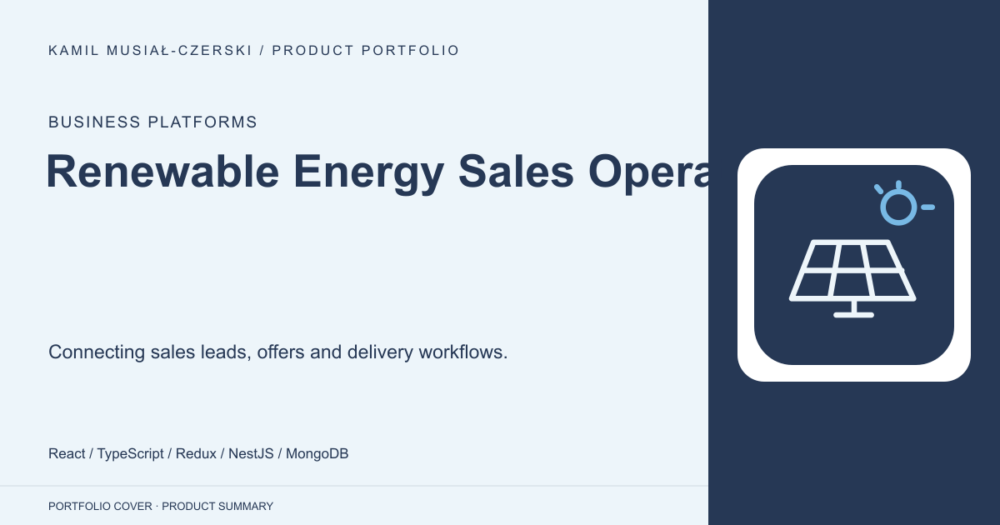
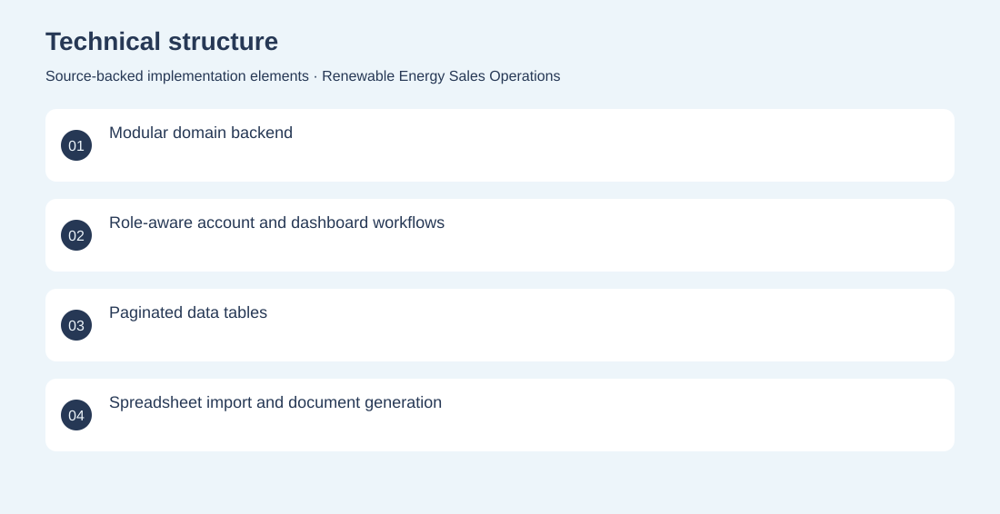

# Renewable Energy Sales Operations

Connecting sales leads, offers and delivery workflows.

**Business Platforms · Archived implementation; current deployment unverified**

A full-stack operations platform for a renewable-energy sales organisation. It brings account roles, customer and lead management, offers, reporting and installation-related workflows into one application. Built a React dashboard and modular NestJS API with persistent records, role-aware workflows, spreadsheet handling and document-generation components. Archived implementation; current deployment unverified. No adoption, revenue or deployment claims are inferred from the repository.

## Problem

Sales teams need to coordinate customer information, commercial offers and delivery progress without scattering work across separate tools.

## Solution

Built a React dashboard and modular NestJS API with persistent records, role-aware workflows, spreadsheet handling and document-generation components.

## My contribution

Full-stack application engineering across sales workflows, dashboards, backend modules and business-document handling.

## Technology

React; TypeScript; Redux; NestJS; MongoDB; Mongoose; Chart.js

## Technical structure

Modular domain backend; Role-aware account and dashboard workflows; Paginated data tables; Spreadsheet import and document generation

## Visuals

Portfolio cover and new project marks are editorial artwork. Only product views explicitly identified as captures represent screenshots.

[Complete portfolio](../README.md)
