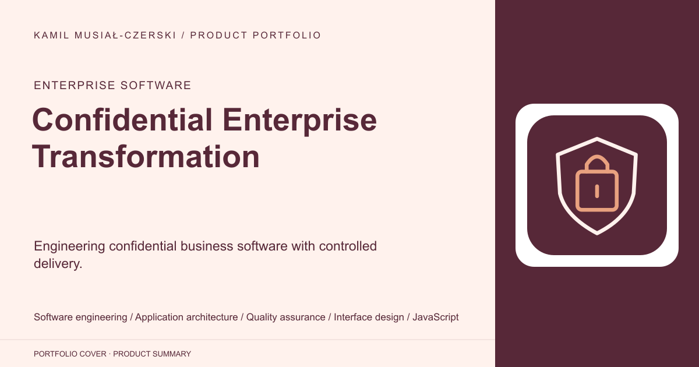
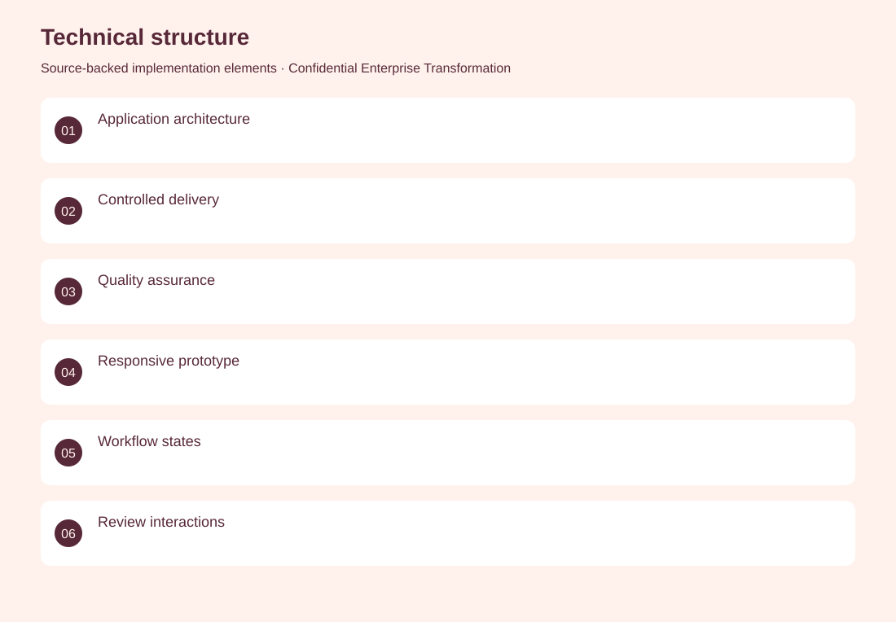
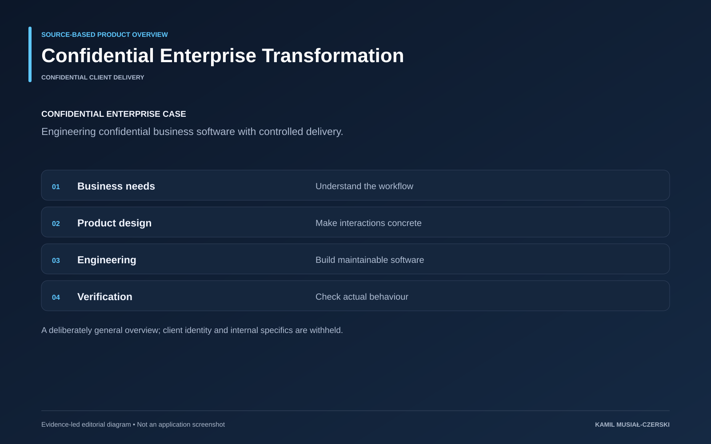

# Confidential Enterprise Transformation

Engineering confidential business software with controlled delivery.

**Enterprise software · Confidential client delivery**

Contributed to confidential enterprise software, translating business needs into maintainable digital workflows and verified application behaviour. An integrated engineering approach connects product design, application development and quality assurance.

## Problem

Support complex business processes through reliable software.

## Solution

An integrated engineering approach connects product design, application development and quality assurance.

## My contribution

Contributed application architecture, business-workflow implementation and delivery verification within a confidential engagement.

## Technology

Software engineering; Application architecture; Quality assurance; Interface design; JavaScript; Interactive prototyping; Test design; Engineering validation

## Technical structure

Application architecture; Controlled delivery; Quality assurance; Responsive prototype; Workflow states; Review interactions; Controlled fixtures; Independent verification

## Visuals

Portfolio cover and new project marks are editorial artwork. Only product views explicitly identified as captures represent screenshots.

[Complete portfolio](../README.md)

