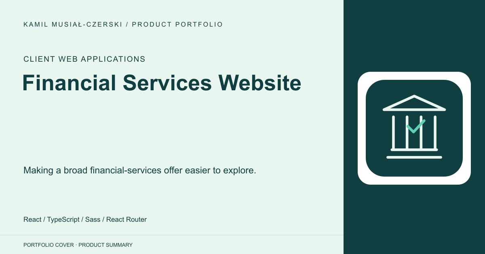
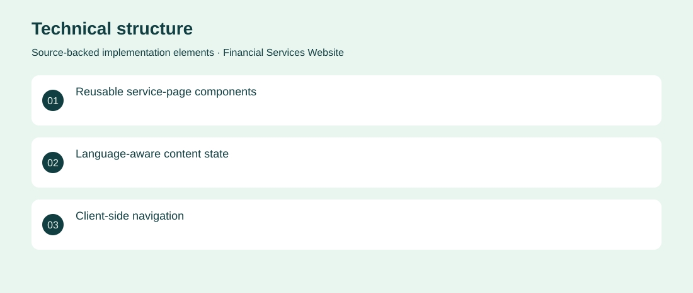

# Financial Services Website

Making a broad financial-services offer easier to explore.

**Client Web Applications · Archived client implementation**

A multilingual financial-services website with dedicated sections for financing, insurance, investment and business support. Modular React components keep the service presentation consistent across pages. Created a structured, multilingual interface with reusable navigation, service cards and content sections. Archived client implementation. No adoption, revenue or deployment claims are inferred from the repository.

## Problem

A broad financial offering is difficult to navigate when every service uses an unrelated presentation.

## Solution

Created a structured, multilingual interface with reusable navigation, service cards and content sections.

## My contribution

Frontend engineering of the page structure, reusable components and language-dependent content.

## Technology

React; TypeScript; Sass; React Router

## Technical structure

Reusable service-page components; Language-aware content state; Client-side navigation

## Visuals

Portfolio cover and new project marks are editorial artwork. Only product views explicitly identified as captures represent screenshots.

[Complete portfolio](../README.md)
