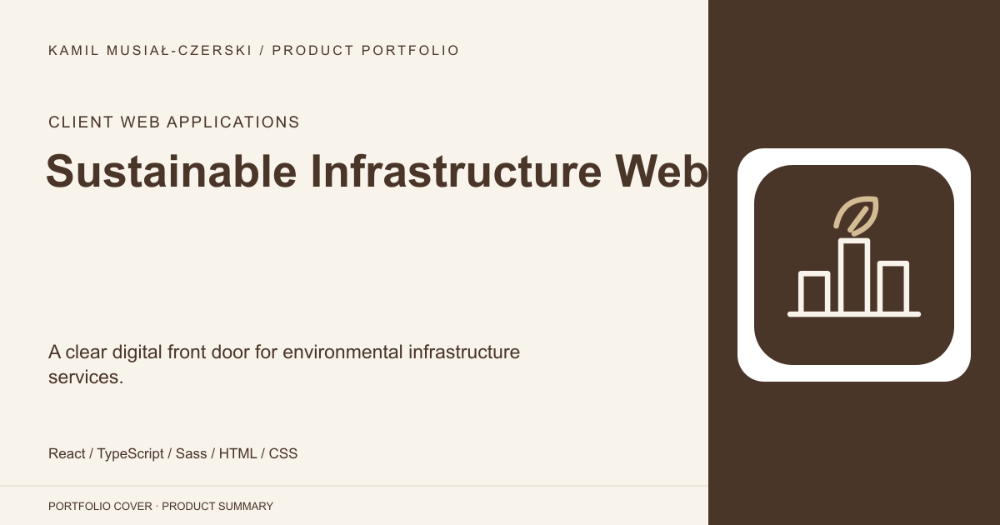
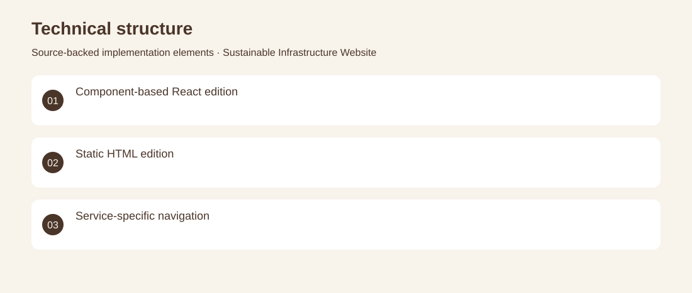

# Sustainable Infrastructure Website

A clear digital front door for environmental infrastructure services.

**Client Web Applications · Archived client websites**

A corporate web experience for renewable-energy and water-treatment services, developed through React and static-web iterations. The interface combines service navigation, visual sections and language controls. Built structured service pages, responsive navigation and reusable content blocks. Archived client websites. No adoption, revenue or deployment claims are inferred from the repository.

## Problem

Visitors need an accessible route from a company overview to distinct technical service areas.

## Solution

Built structured service pages, responsive navigation and reusable content blocks.

## My contribution

Frontend development and implementation of the company-service presentation.

## Technology

React; TypeScript; Sass; HTML; CSS

## Technical structure

Component-based React edition; Static HTML edition; Service-specific navigation

## Visuals

Portfolio cover and new project marks are editorial artwork. Only product views explicitly identified as captures represent screenshots.

[Complete portfolio](../README.md)
