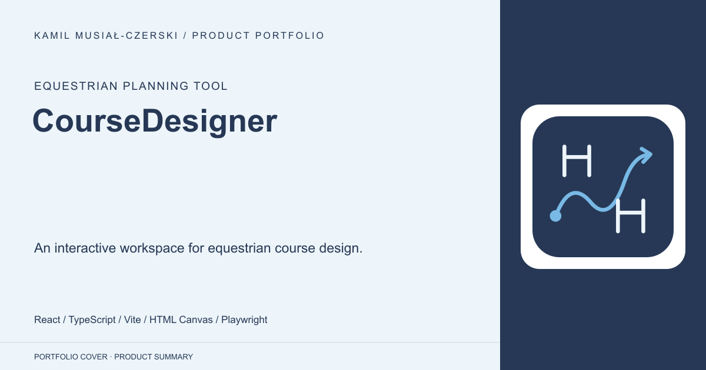
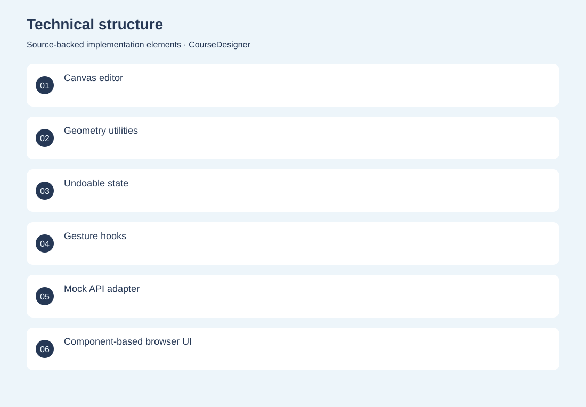
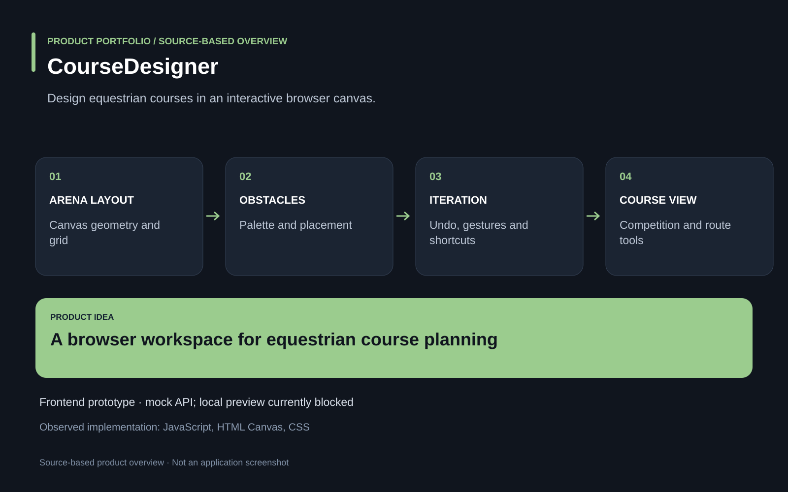

# CourseDesigner

An interactive workspace for equestrian course design.

**Equestrian planning tool · Interactive frontend prototype. The inspected repository uses a fake API; cloud persistence and production authentication are not established. Local preview on 2026-09-25 was blocked by a duplicate state declaration in TopBar.tsx.**

Course designers need to place obstacles, adjust geometry and iterate on layouts without losing previous versions.

A React/TypeScript canvas editor combines obstacle placement, geometry utilities, touch gestures, shortcuts and undoable interaction history. Developed the frontend planning experience, reusable canvas tools and state/history logic.

Interactive frontend prototype. The inspected repository uses a fake API; cloud persistence and production authentication are not established.

## Problem

Course designers need to place obstacles, adjust geometry and iterate on layouts without losing previous versions.

## Solution

A React/TypeScript canvas editor combines obstacle placement, geometry utilities, touch gestures, shortcuts and undoable interaction history.

## My contribution

Developed the frontend planning experience, reusable canvas tools and state/history logic.

## Technology

React; TypeScript; Vite; HTML Canvas; Playwright; JavaScript; CSS

## Technical structure

Canvas editor; Geometry utilities; Undoable state; Gesture hooks; Mock API adapter; Component-based browser UI; Canvas drawing engine; Obstacle and zone toolbars

## Visuals

Portfolio cover and new project marks are editorial artwork. Only product views explicitly identified as captures represent screenshots.

[Complete portfolio](../README.md)

