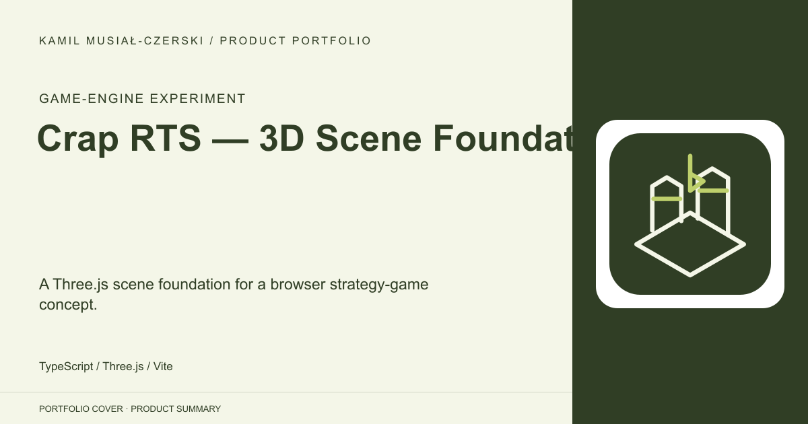
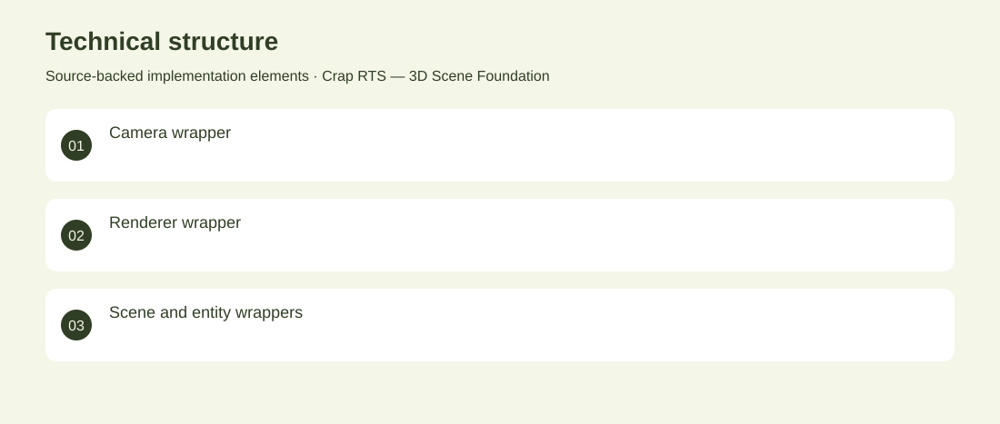

# Crap RTS — 3D Scene Foundation

A Three.js scene foundation for a browser strategy-game concept.

**Game-engine experiment · Archived rendering experiment; RTS gameplay is not implemented in the inspected source.**

Explore a reusable structure for browser-based 3D game scenes.

Typed wrappers separate the camera, renderer, scene and entity handling around a simple rendered cube. Implemented the scene abstractions and continuous render loop.

Archived rendering experiment; RTS gameplay is not implemented in the inspected source.

## Problem

Explore a reusable structure for browser-based 3D game scenes.

## Solution

Typed wrappers separate the camera, renderer, scene and entity handling around a simple rendered cube.

## My contribution

Implemented the scene abstractions and continuous render loop.

## Technology

TypeScript; Three.js; Vite

## Technical structure

Camera wrapper; Renderer wrapper; Scene and entity wrappers

## Visuals

Portfolio cover and new project marks are editorial artwork. Only product views explicitly identified as captures represent screenshots.

[Complete portfolio](../README.md)
