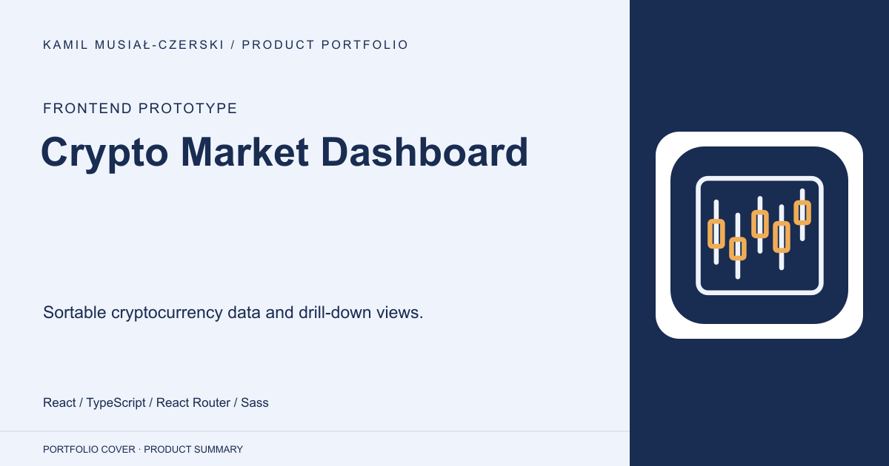
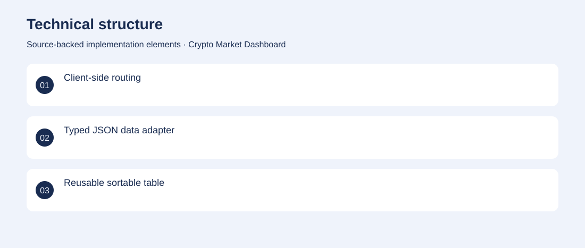

# Crypto Market Dashboard

Sortable cryptocurrency data and drill-down views.

**Frontend prototype · Archived UI prototype using bundled JSON snapshots; no live feed verified.**

Make a cryptocurrency dataset easier to browse and compare.

A React interface presents a sortable market table and symbol-specific detail routes. Developed reusable table components, sorting controls, typed data helpers and routed detail views.

Archived UI prototype using bundled JSON snapshots; no live feed verified.

## Problem

Make a cryptocurrency dataset easier to browse and compare.

## Solution

A React interface presents a sortable market table and symbol-specific detail routes.

## My contribution

Developed reusable table components, sorting controls, typed data helpers and routed detail views.

## Technology

React; TypeScript; React Router; Sass

## Technical structure

Client-side routing; Typed JSON data adapter; Reusable sortable table

## Visuals

Portfolio cover and new project marks are editorial artwork. Only product views explicitly identified as captures represent screenshots.

[Complete portfolio](../README.md)
