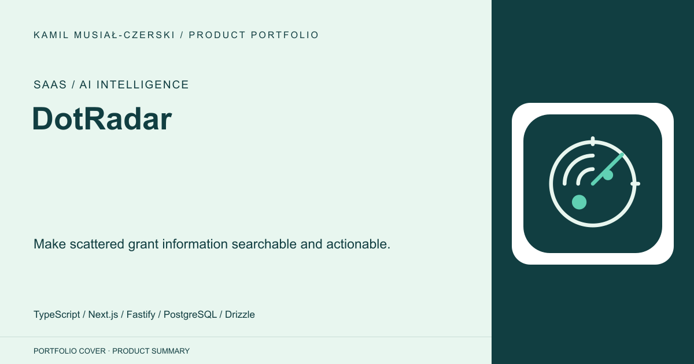
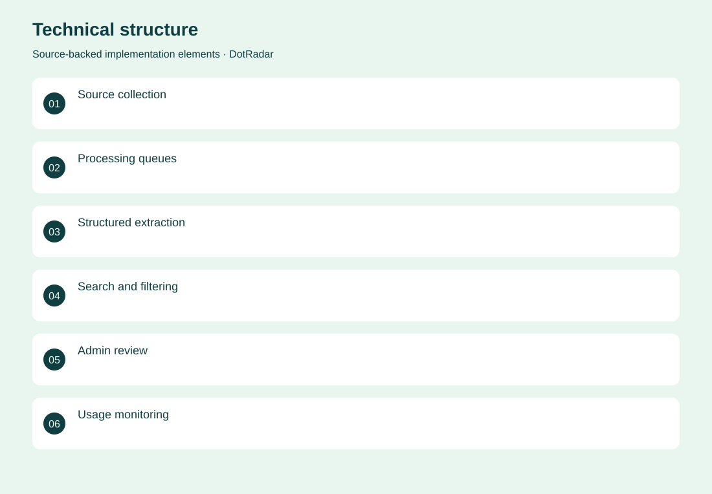
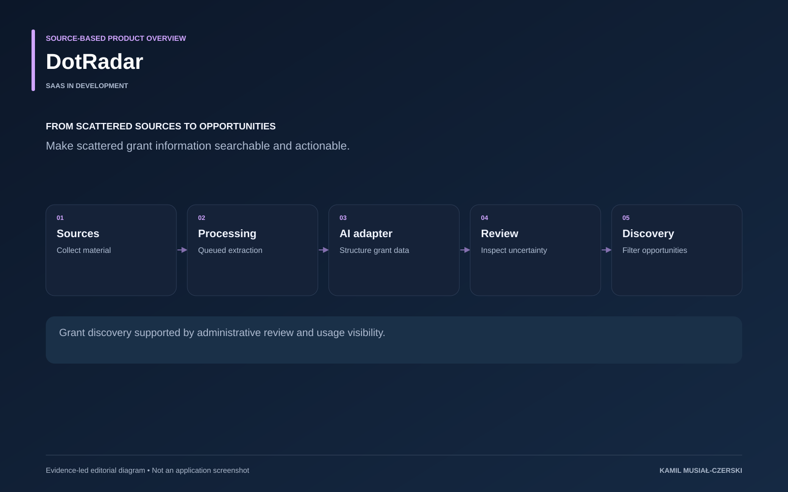

# DotRadar

Make scattered grant information searchable and actionable.

**SaaS / AI intelligence · SaaS in development**

Collection, extraction and presentation are separate stages. Processing queues organize incoming source material; model adapters turn free text into structured opportunity data; administrative screens expose review and processing costs. The product brings grants into a consistent discovery workflow while keeping uncertain data visible for review.

## Problem

Funding opportunities are fragmented across sources and difficult to monitor consistently.

## Solution

A collection and processing pipeline normalizes opportunities, while filtering and administrative review support discovery.

## My contribution

Implemented source-processing workflows, structured grant extraction, administrative review and usage visibility.

## Technology

TypeScript; Next.js; Fastify; PostgreSQL; Drizzle; Redis; BullMQ; Playwright; Ollama; Python; FastAPI; React Native

## Technical structure

Source collection; Processing queues; Structured extraction; Search and filtering; Admin review; Usage monitoring; Authentication API; Grant service; Profile workflows; Mobile client

## AI capabilities

Grant information extraction; Provider-selectable LLM processing; Embeddings

## Visuals

Portfolio cover and new project marks are editorial artwork. Only product views explicitly identified as captures represent screenshots.

[Complete portfolio](../README.md)

