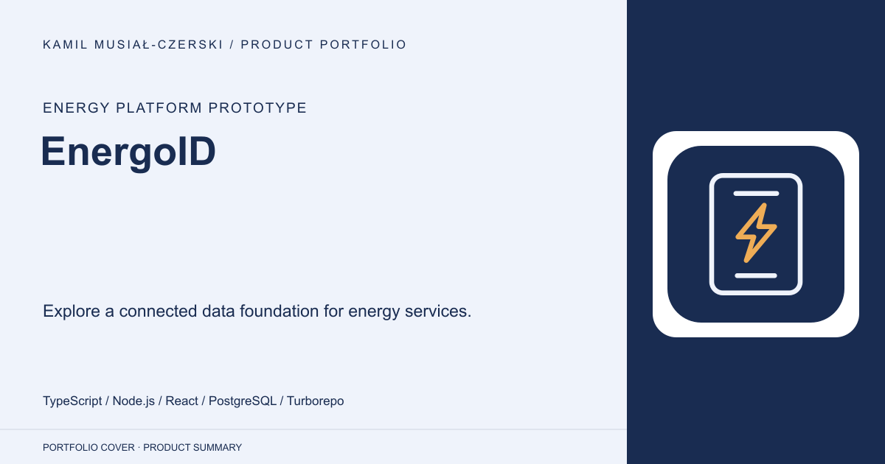
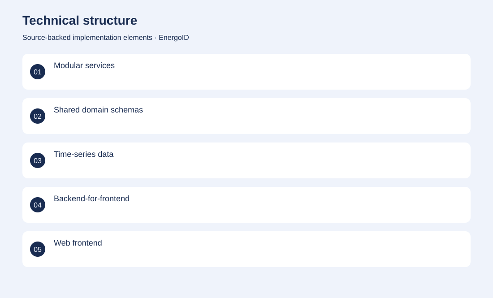
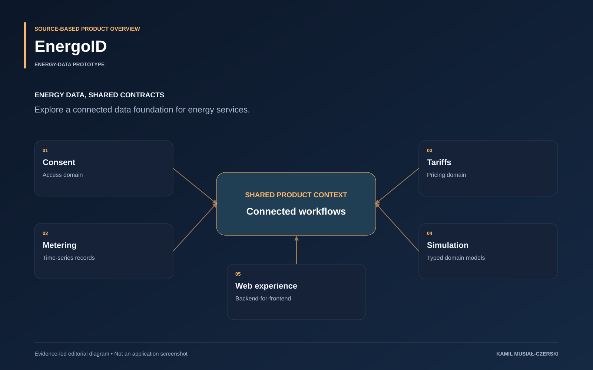

# EnergoID

Explore a connected data foundation for energy services.

**Energy platform prototype · Energy-data prototype**

Engineering work on an energy-platform prototype spanning consent, metering, tariff and simulation domains, shared service contracts and a web experience. A typed monorepo combines domain services, shared validation, observability and a frontend application. The prototype focuses on energy-domain models, service boundaries and web workflows.

## Problem

Energy workflows require consistent domain models and controlled access across fragmented data sources.

## Solution

A typed monorepo combines domain services, shared validation, observability and a frontend application.

## My contribution

Contributed domain modelling, shared validation and service structure for the energy-data prototype.

## Technology

TypeScript; Node.js; React; PostgreSQL; Turborepo; Docker; Vitest; Playwright

## Technical structure

Modular services; Shared domain schemas; Time-series data; Backend-for-frontend; Web frontend

## Visuals

Portfolio cover and new project marks are editorial artwork. Only product views explicitly identified as captures represent screenshots.

[Complete portfolio](../README.md)

