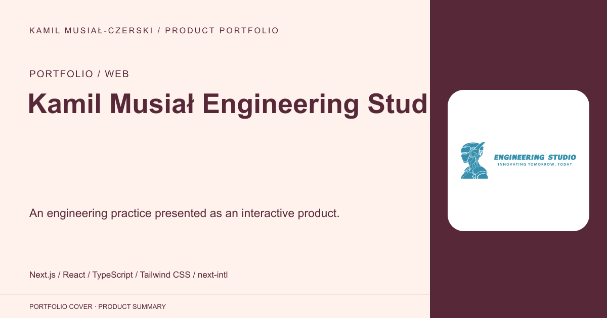
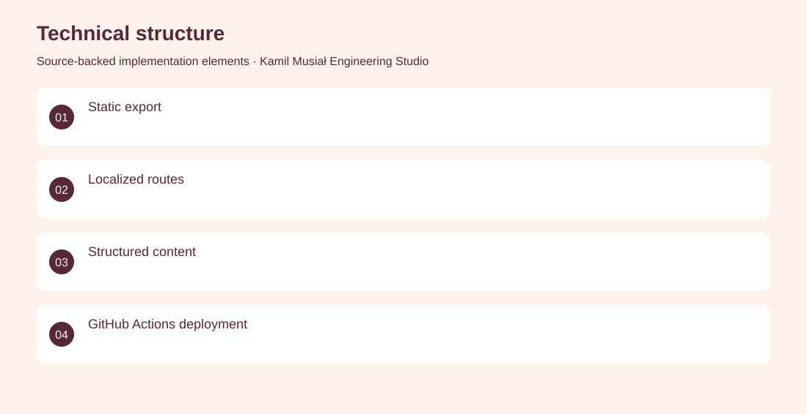
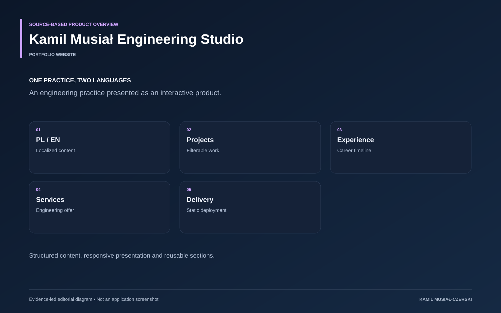

# Kamil Musiał Engineering Studio

An engineering practice presented as an interactive product.

**Portfolio / Web · Portfolio website**

A statically exported Next.js site with reusable content sections and deployment configuration. Structured the portfolio content model and implemented localized pages, interactive sections and static deployment.

## Problem

A broad engineering history needs coherent presentation across languages and devices.

## Solution

A statically exported Next.js site with reusable content sections and deployment configuration.

## My contribution

Structured the portfolio content model and implemented localized pages, interactive sections and static deployment.

## Technology

Next.js; React; TypeScript; Tailwind CSS; next-intl; Framer Motion

## Technical structure

Static export; Localized routes; Structured content; GitHub Actions deployment

## Visuals

Portfolio cover and new project marks are editorial artwork. Only product views explicitly identified as captures represent screenshots.

[Complete portfolio](../README.md)

