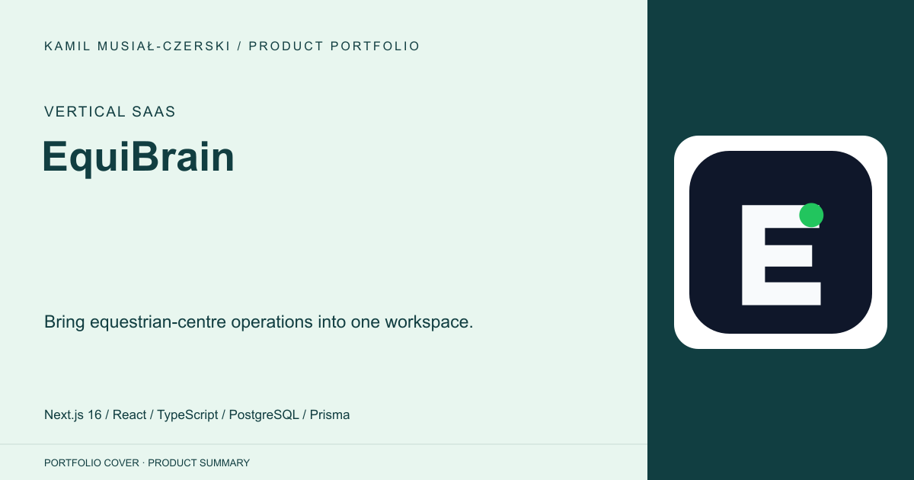
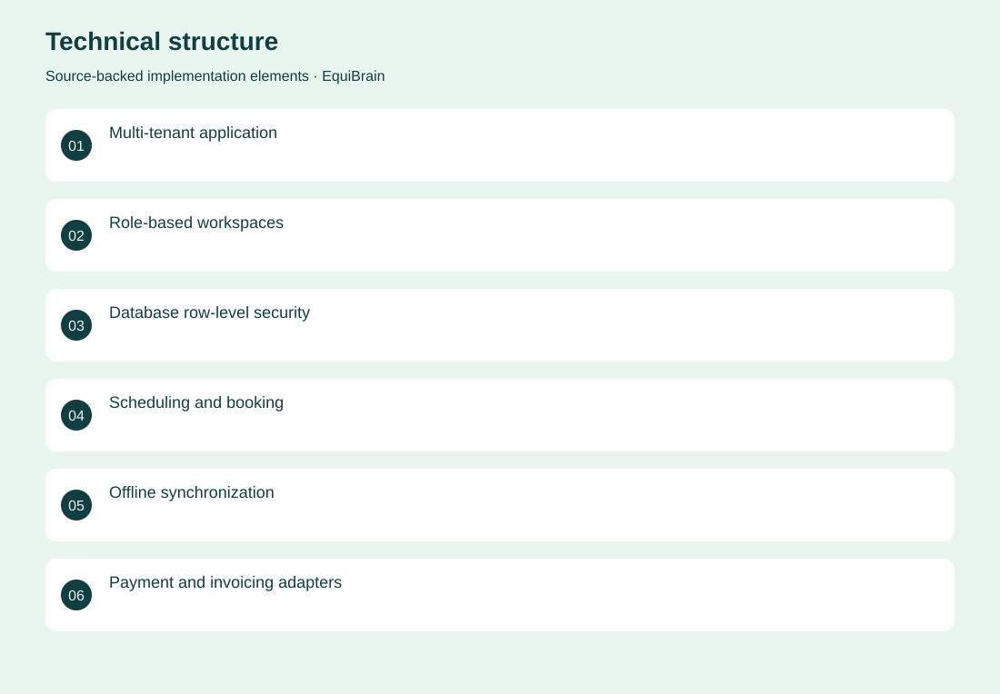
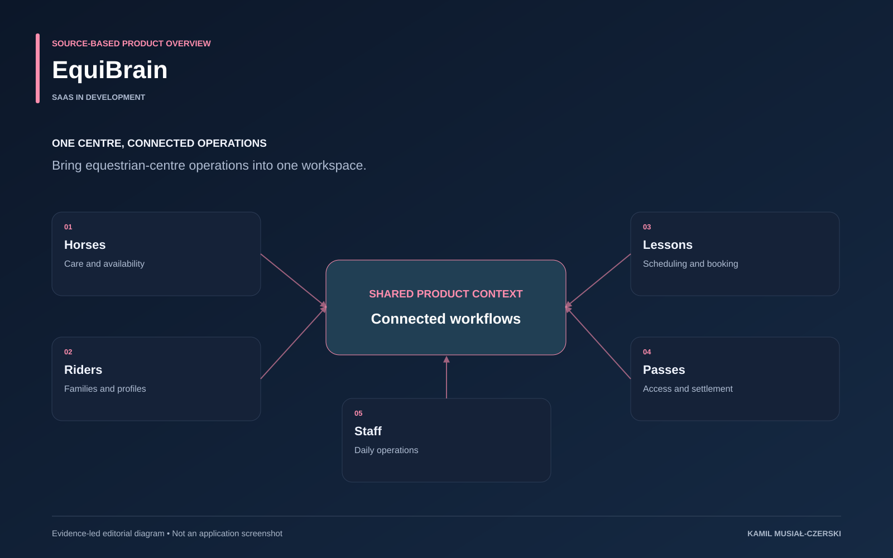

# EquiBrain

Bring equestrian-centre operations into one workspace.

**Vertical SaaS · SaaS in development**

The application models a centre as interconnected horses, riders, families, instructors and operational staff. Booking, passes, waitlists and daily activities share persistent records, while role and tenant boundaries are enforced beyond navigation. The PWA supports selected durable offline writes and reconciliation. The current Next.js and Prisma implementation continues the earlier Rideflow product history.

## Problem

Equestrian centres coordinate interconnected people, horses, lessons and operational tasks.

## Solution

Role-specific workspaces connect scheduling and operational records with tenant-scoped access, persistent data and selected offline workflows.

## My contribution

Implemented role-specific stable operations, booking and pass workflows, tenant isolation and selected offline synchronization.

## Technology

Next.js 16; React; TypeScript; PostgreSQL; Prisma; PWA; Docker; Playwright; Product architecture; Domain modelling; SaaS design

## Technical structure

Multi-tenant application; Role-based workspaces; Database row-level security; Scheduling and booking; Offline synchronization; Payment and invoicing adapters; Domain decisions; Feature mapping; Implementation planning

## Visuals

Portfolio cover and new project marks are editorial artwork. Only product views explicitly identified as captures represent screenshots.

[Complete portfolio](../README.md)

