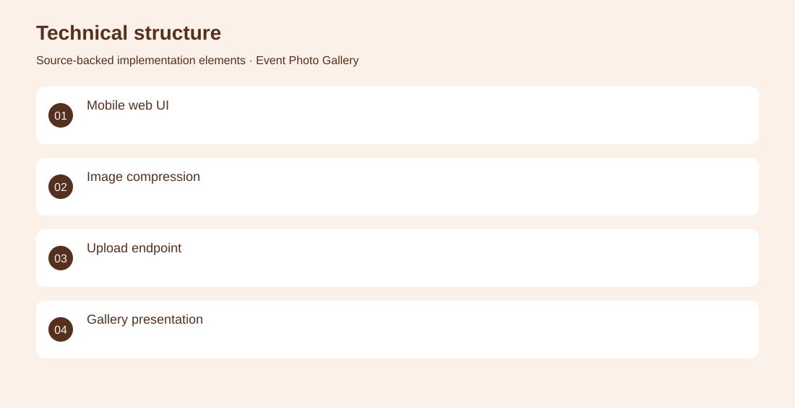

# Event Photo Gallery

A simple shared photo collection for a live event.

**Event technology · Personal event application**

A mobile-oriented browser interface uploads optimized images to a small Node.js service. Implemented mobile photo uploads, browser-side image compression and gallery presentation.

## Problem

Guests need a low-friction way to contribute event photos from a phone.

## Solution

A mobile-oriented browser interface uploads optimized images to a small Node.js service.

## My contribution

Implemented mobile photo uploads, browser-side image compression and gallery presentation.

## Technology

JavaScript; Node.js; Express; Browser Image Compression; PWA

## Technical structure

Mobile web UI; Image compression; Upload endpoint; Gallery presentation

## Visuals

Portfolio cover and new project marks are editorial artwork. Only product views explicitly identified as captures represent screenshots.

[Complete portfolio](../README.md)

