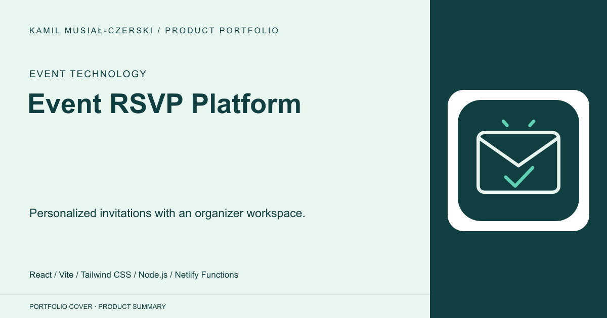
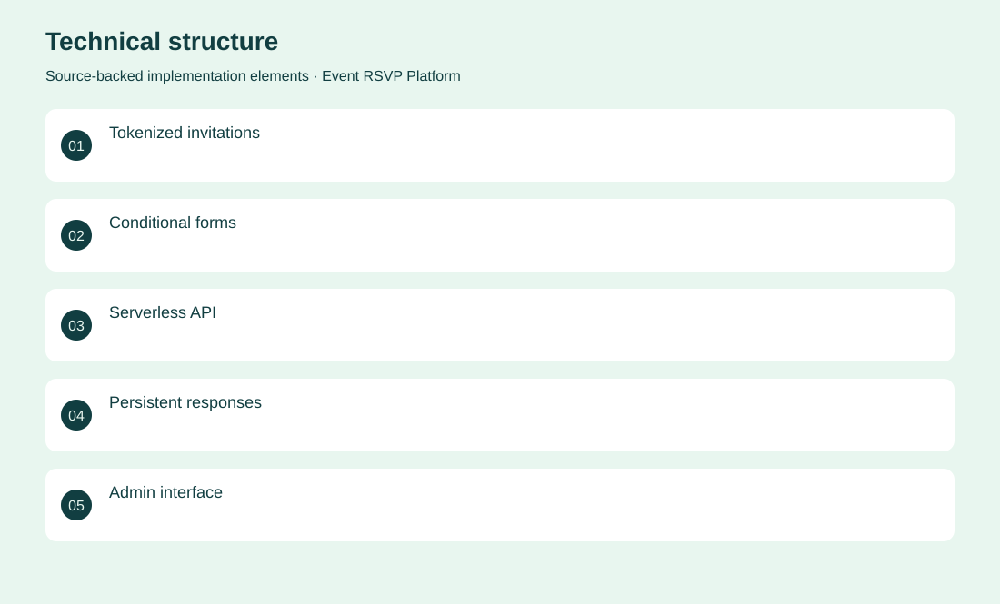
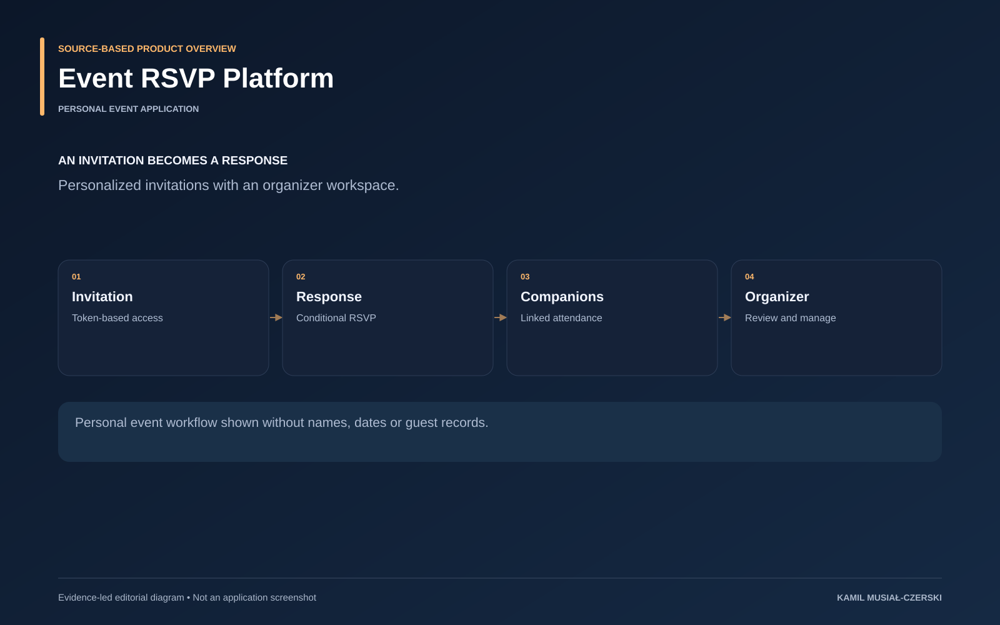

# Event RSVP Platform

Personalized invitations with an organizer workspace.

**Event technology · Personal event application**

A personalized guest flow is backed by serverless endpoints and a simple administrative workspace. Implemented invitation access, conditional RSVP handling, companion logic and organizer administration.

## Problem

Organizers need consistent attendance information without repeated manual follow-up.

## Solution

A personalized guest flow is backed by serverless endpoints and a simple administrative workspace.

## My contribution

Implemented invitation access, conditional RSVP handling, companion logic and organizer administration.

## Technology

React; Vite; Tailwind CSS; Node.js; Netlify Functions; Netlify Blobs

## Technical structure

Tokenized invitations; Conditional forms; Serverless API; Persistent responses; Admin interface

## Visuals

Portfolio cover and new project marks are editorial artwork. Only product views explicitly identified as captures represent screenshots.

[Complete portfolio](../README.md)

