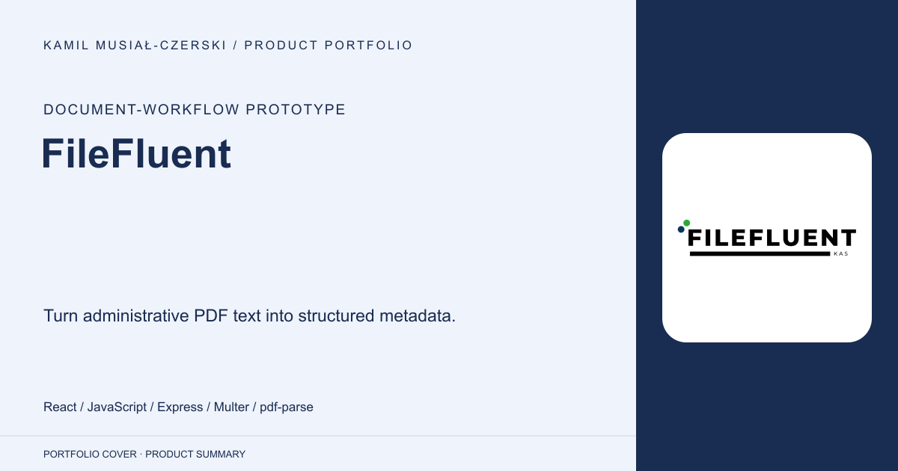
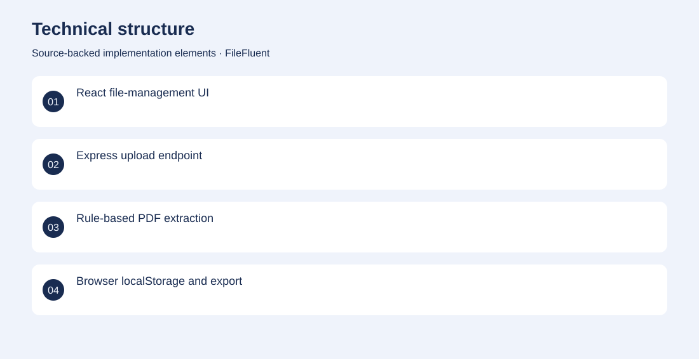
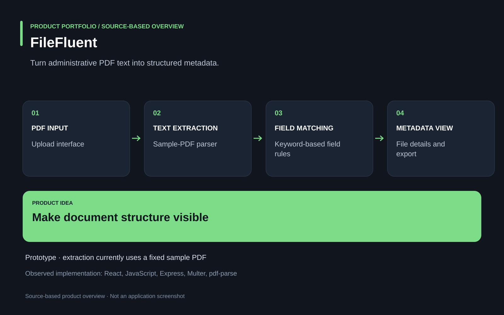

# FileFluent

Turn administrative PDF text into structured metadata.

**Document-workflow prototype · Archived prototype. The parser currently reads a fixed sample PDF; general uploaded-document processing is not established.**

Administrative documents contain repeated identifiers and fields that are tedious to inspect manually.

A prototype connects document upload and file-detail screens with keyword-based PDF text extraction and downloadable metadata. Contributed to the React workflow and Node.js extraction prototype, connecting parsed document fields to a file-detail interface.

Archived prototype. The parser currently reads a fixed sample PDF; general uploaded-document processing is not established.

## Problem

Administrative documents contain repeated identifiers and fields that are tedious to inspect manually.

## Solution

A prototype connects document upload and file-detail screens with keyword-based PDF text extraction and downloadable metadata.

## My contribution

Contributed to the React workflow and Node.js extraction prototype, connecting parsed document fields to a file-detail interface.

## Technology

React; JavaScript; Express; Multer; pdf-parse

## Technical structure

React file-management UI; Express upload endpoint; Rule-based PDF extraction; Browser localStorage and export

## Visuals

Portfolio cover and new project marks are editorial artwork. Only product views explicitly identified as captures represent screenshots.

[Complete portfolio](../README.md)

