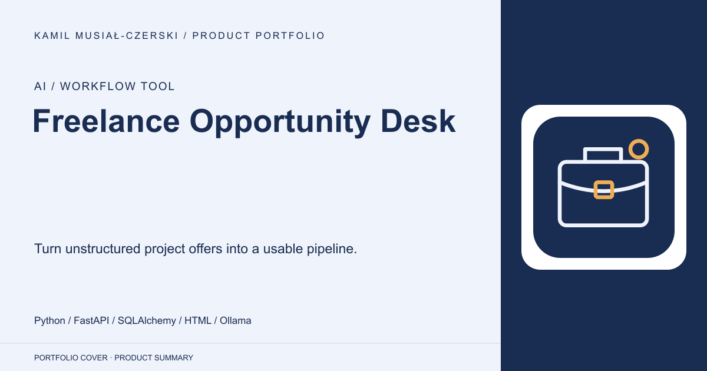
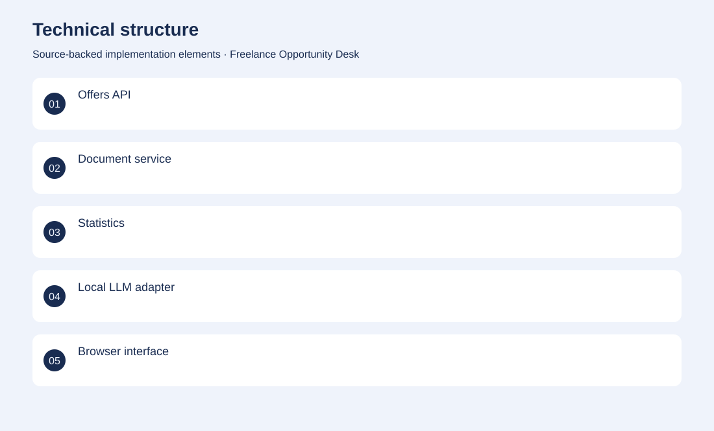
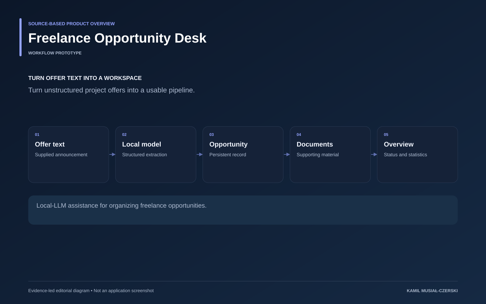

# Freelance Opportunity Desk

Turn unstructured project offers into a usable pipeline.

**AI / Workflow tool · Workflow prototype**

A browser workspace and API turn offer text into structured records and support follow-up preparation. Implemented offer records, document handling and a local-model adapter for extracting structured opportunity details.

## Problem

Freelance opportunities arrive as inconsistent free text that is hard to compare and track.

## Solution

A browser workspace and API turn offer text into structured records and support follow-up preparation.

## My contribution

Implemented offer records, document handling and a local-model adapter for extracting structured opportunity details.

## Technology

Python; FastAPI; SQLAlchemy; HTML; Ollama; Docker

## Technical structure

Offers API; Document service; Statistics; Local LLM adapter; Browser interface

## AI capabilities

Structured offer extraction; Local language-model analysis

## Visuals

Portfolio cover and new project marks are editorial artwork. Only product views explicitly identified as captures represent screenshots.

[Complete portfolio](../README.md)

