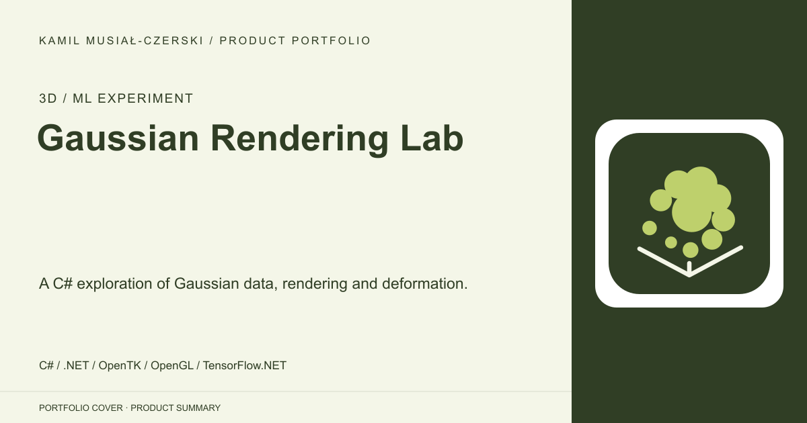
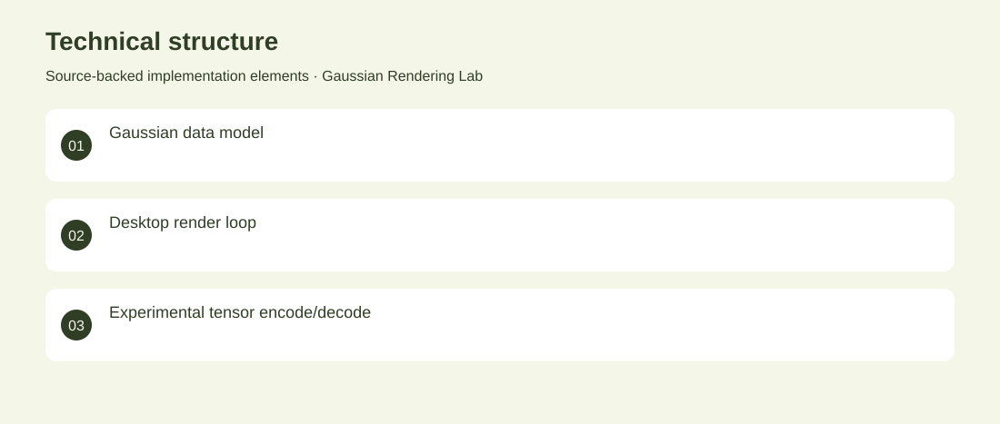

# Gaussian Rendering Lab

A C# exploration of Gaussian data, rendering and deformation.

**3D / ML experiment · Early archived experiment. It is not a validated Gaussian-splatting reconstruction system or trained deformation model.**

Explore how Gaussian point representations and tensor operations can be organized in a desktop graphics experiment.

The project defines Gaussian data structures, an OpenTK rendering loop and a TensorFlow.NET deformation-class experiment. Implemented the C# experiment structure, point-rendering code and basic tensor encode/decode operations.

Early archived experiment. It is not a validated Gaussian-splatting reconstruction system or trained deformation model.

## Problem

Explore how Gaussian point representations and tensor operations can be organized in a desktop graphics experiment.

## Solution

The project defines Gaussian data structures, an OpenTK rendering loop and a TensorFlow.NET deformation-class experiment.

## My contribution

Implemented the C# experiment structure, point-rendering code and basic tensor encode/decode operations.

## Technology

C#; .NET; OpenTK; OpenGL; TensorFlow.NET

## Technical structure

Gaussian data model; Desktop render loop; Experimental tensor encode/decode

## Visuals

Portfolio cover and new project marks are editorial artwork. Only product views explicitly identified as captures represent screenshots.

[Complete portfolio](../README.md)
