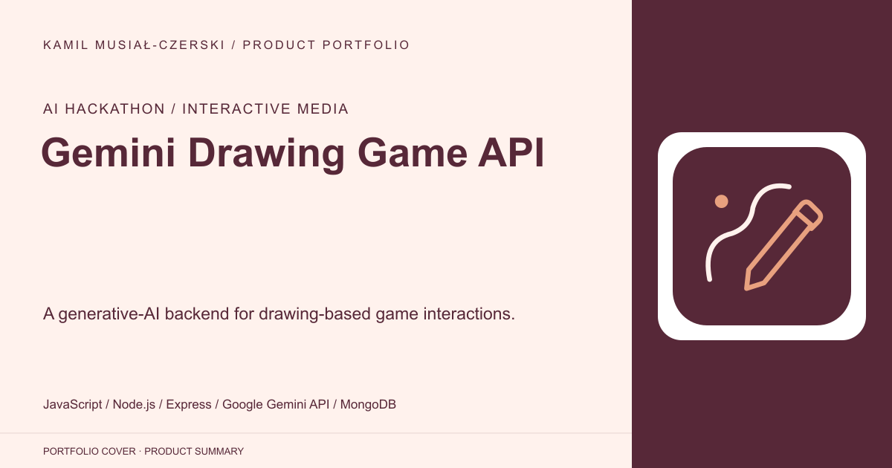
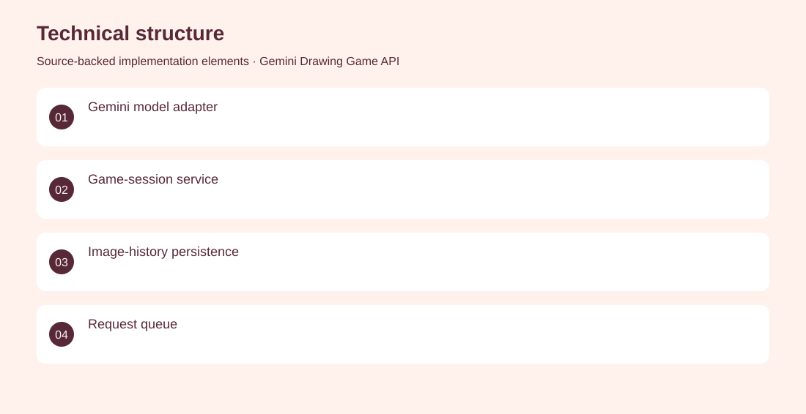
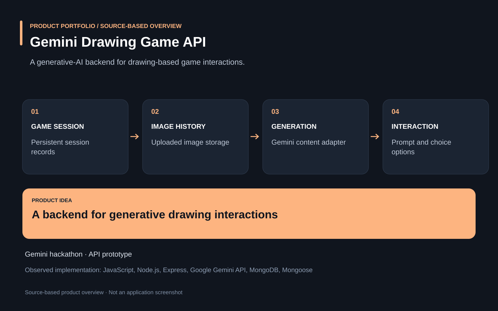

# Gemini Drawing Game API

A generative-AI backend for drawing-based game interactions.

**AI hackathon / interactive media · Archived Gemini hackathon prototype; no live demo or production readiness verified.**

Interactive drawing experiences need to connect game sessions, uploaded images and model responses.

A Node.js prototype combines Gemini content generation with game-session records, uploaded image history, prompt options and queued request handling. Developed backend services connecting Gemini generation, image storage and persistent game sessions.

Archived Gemini hackathon prototype; no live demo or production readiness verified.

## Problem

Interactive drawing experiences need to connect game sessions, uploaded images and model responses.

## Solution

A Node.js prototype combines Gemini content generation with game-session records, uploaded image history, prompt options and queued request handling.

## My contribution

Developed backend services connecting Gemini generation, image storage and persistent game sessions.

## Technology

JavaScript; Node.js; Express; Google Gemini API; MongoDB; Mongoose

## Technical structure

Gemini model adapter; Game-session service; Image-history persistence; Request queue

## AI capabilities

Gemini content-generation integration

## Visuals

Portfolio cover and new project marks are editorial artwork. Only product views explicitly identified as captures represent screenshots.

[Complete portfolio](../README.md)

