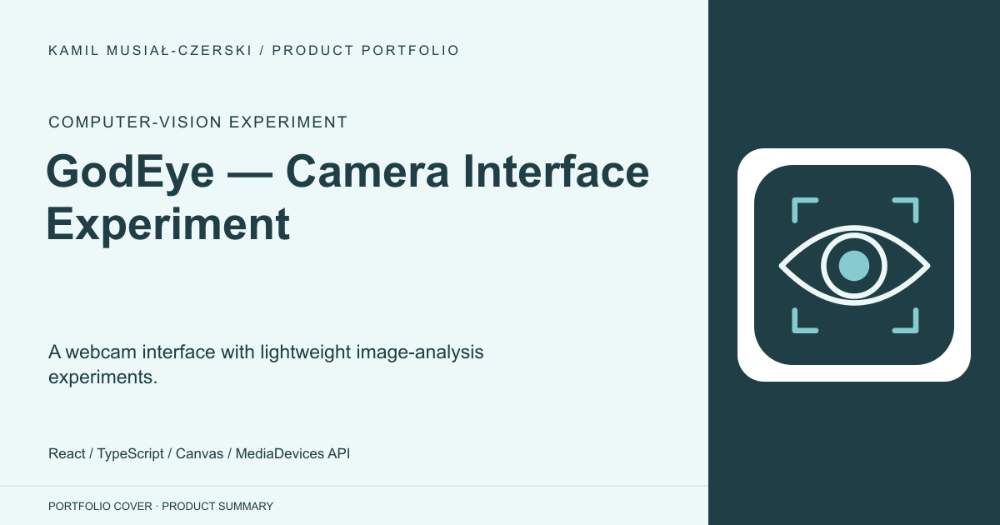
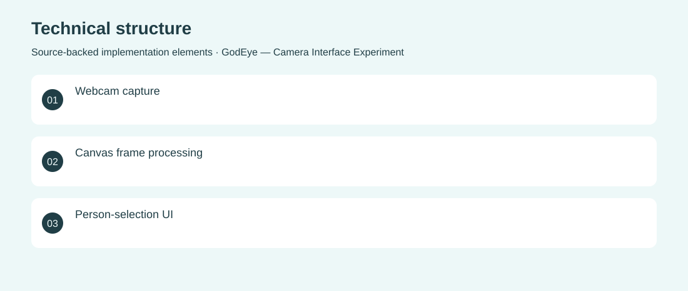

# GodEye — Camera Interface Experiment

A webcam interface with lightweight image-analysis experiments.

**Computer-vision experiment · Archived experiment; the heuristic is not validated face recognition or identity verification.**

Explore how a browser interface can combine camera capture, person selection and image-analysis feedback.

A React prototype lays out camera and information panels and tests pixel-color heuristics on captured webcam frames. Implemented the camera capture interface, selection components and an experimental skin-color detection routine.

Archived experiment; the heuristic is not validated face recognition or identity verification.

## Problem

Explore how a browser interface can combine camera capture, person selection and image-analysis feedback.

## Solution

A React prototype lays out camera and information panels and tests pixel-color heuristics on captured webcam frames.

## My contribution

Implemented the camera capture interface, selection components and an experimental skin-color detection routine.

## Technology

React; TypeScript; Canvas; MediaDevices API

## Technical structure

Webcam capture; Canvas frame processing; Person-selection UI

## Visuals

Portfolio cover and new project marks are editorial artwork. Only product views explicitly identified as captures represent screenshots.

[Complete portfolio](../README.md)
