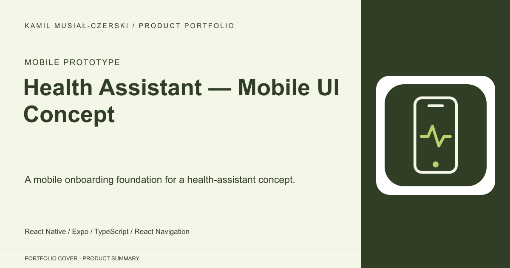
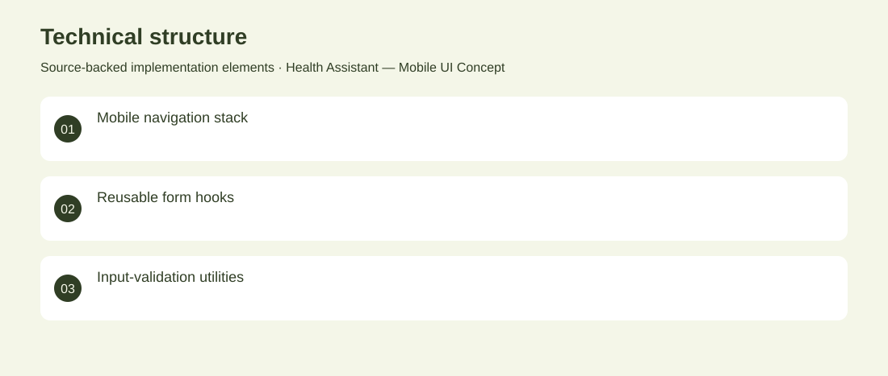

# Health Assistant — Mobile UI Concept

A mobile onboarding foundation for a health-assistant concept.

**Mobile prototype · Archived mobile UI foundation. No diagnostic model, symptom assessment, medical validation or backend authentication is implemented in the reviewed flow.**

Explore a simple mobile entry flow for a future health-information application.

A React Native prototype implements home, login and registration navigation with reusable input and button hooks. Developed the mobile view structure, reusable form interactions and input-validation utilities.

Archived mobile UI foundation. No diagnostic model, symptom assessment, medical validation or backend authentication is implemented in the reviewed flow.

## Problem

Explore a simple mobile entry flow for a future health-information application.

## Solution

A React Native prototype implements home, login and registration navigation with reusable input and button hooks.

## My contribution

Developed the mobile view structure, reusable form interactions and input-validation utilities.

## Technology

React Native; Expo; TypeScript; React Navigation

## Technical structure

Mobile navigation stack; Reusable form hooks; Input-validation utilities

## Visuals

Portfolio cover and new project marks are editorial artwork. Only product views explicitly identified as captures represent screenshots.

[Complete portfolio](../README.md)
