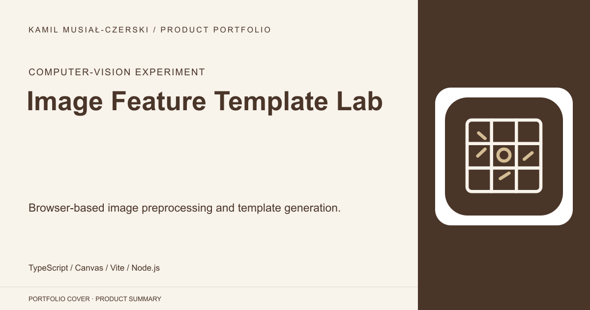
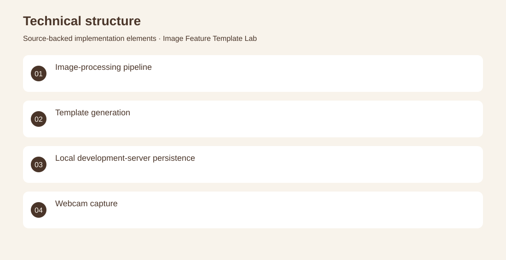

# Image Feature Template Lab

Browser-based image preprocessing and template generation.

**Computer-vision experiment · Archived technical prototype; identity-recognition accuracy and production deployment are not established.**

Explore the preprocessing steps used before comparing visual image features.

An image-upload workflow converts images to grayscale, resizes and equalizes them, then saves generated templates through a development-server endpoint. Implemented image-processing utilities, feature-template creation, upload handling and a Vite persistence plugin.

Archived technical prototype; identity-recognition accuracy and production deployment are not established.

## Problem

Explore the preprocessing steps used before comparing visual image features.

## Solution

An image-upload workflow converts images to grayscale, resizes and equalizes them, then saves generated templates through a development-server endpoint.

## My contribution

Implemented image-processing utilities, feature-template creation, upload handling and a Vite persistence plugin.

## Technology

TypeScript; Canvas; Vite; Node.js

## Technical structure

Image-processing pipeline; Template generation; Local development-server persistence; Webcam capture

## Visuals

Portfolio cover and new project marks are editorial artwork. Only product views explicitly identified as captures represent screenshots.

[Complete portfolio](../README.md)
