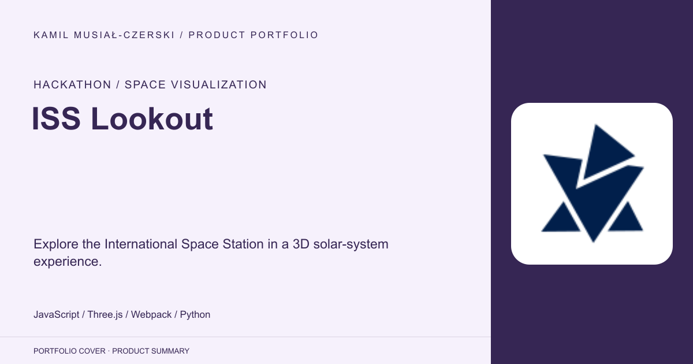
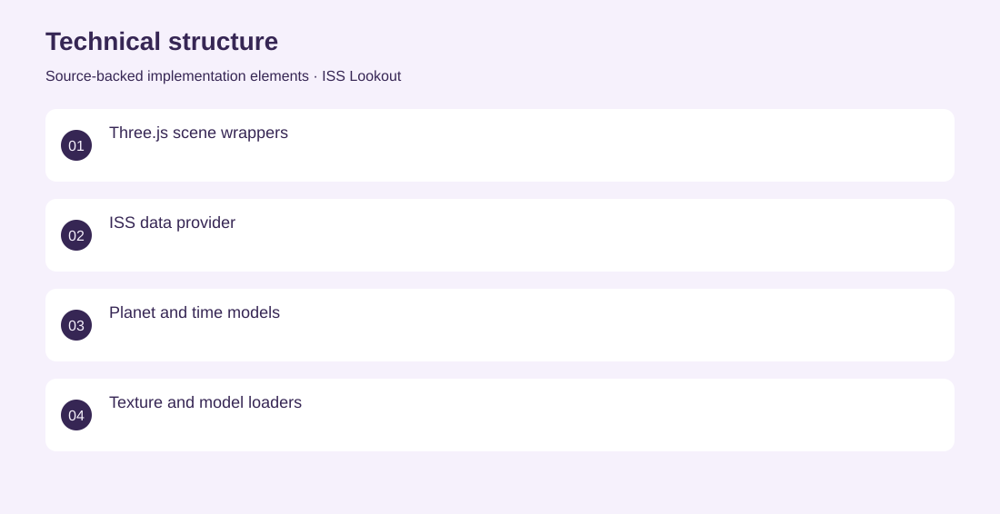
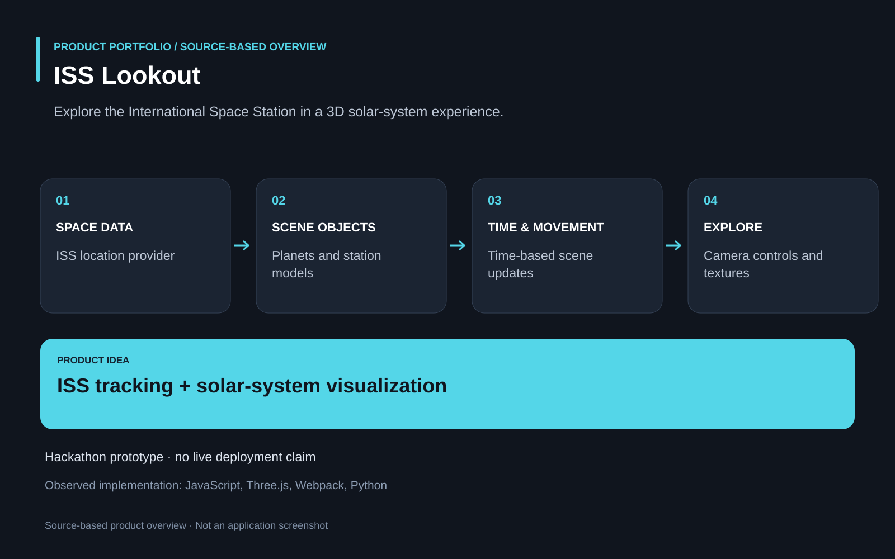

# ISS Lookout

Explore the International Space Station in a 3D solar-system experience.

**Hackathon / space visualization · NASA Space Apps Challenge 2022 prototype; current public deployment not verified.**

Make space-station tracking and planetary context understandable through an interactive visual experience.

A browser application combines an ISS data provider with Three.js scene components, planet textures, camera controls and time-based movement. Contributed to the hackathon application, including the engineering of interactive space visualization and data-driven scene behavior.

NASA Space Apps Challenge 2022 prototype; current public deployment not verified.

## Problem

Make space-station tracking and planetary context understandable through an interactive visual experience.

## Solution

A browser application combines an ISS data provider with Three.js scene components, planet textures, camera controls and time-based movement.

## My contribution

Contributed to the hackathon application, including the engineering of interactive space visualization and data-driven scene behavior.

## Technology

JavaScript; Three.js; Webpack; Python

## Technical structure

Three.js scene wrappers; ISS data provider; Planet and time models; Texture and model loaders

## Visuals

Portfolio cover and new project marks are editorial artwork. Only product views explicitly identified as captures represent screenshots.

[Complete portfolio](../README.md)

