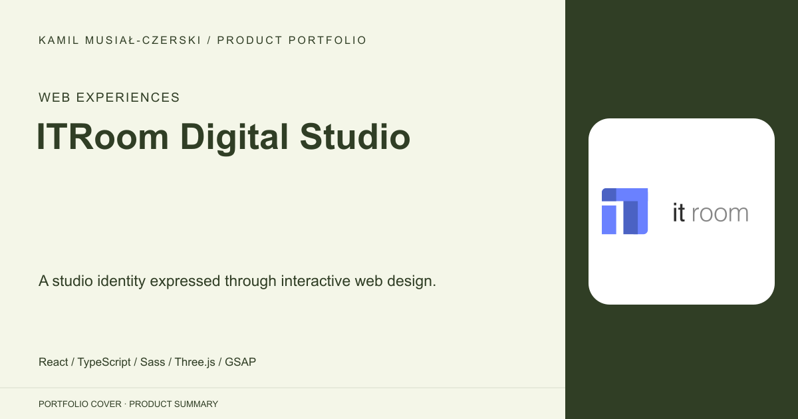
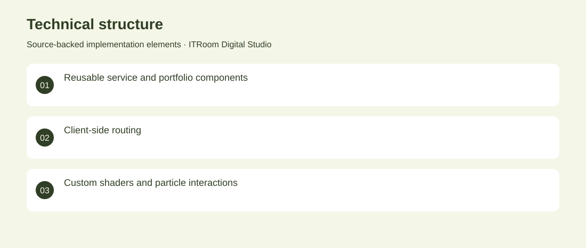

# ITRoom Digital Studio

A studio identity expressed through interactive web design.

**Web Experiences · Archived website iterations**

A series of digital-studio websites spanning a React service portfolio, a richer WebGL edition and a custom visual identity. The work presents services, selected projects and contact journeys. Built component-based marketing pages and evolved the presentation into animation, particles and interactive 3D scenes. Archived website iterations. No adoption, revenue or deployment claims are inferred from the repository.

## Problem

A digital studio needs its website to demonstrate the quality of its own engineering and design.

## Solution

Built component-based marketing pages and evolved the presentation into animation, particles and interactive 3D scenes.

## My contribution

Frontend development, responsive composition, interaction design and studio branding across successive versions.

## Technology

React; TypeScript; Sass; Three.js; GSAP; WebGL

## Technical structure

Reusable service and portfolio components; Client-side routing; Custom shaders and particle interactions

## Visuals

Portfolio cover and new project marks are editorial artwork. Only product views explicitly identified as captures represent screenshots.

[Complete portfolio](../README.md)
