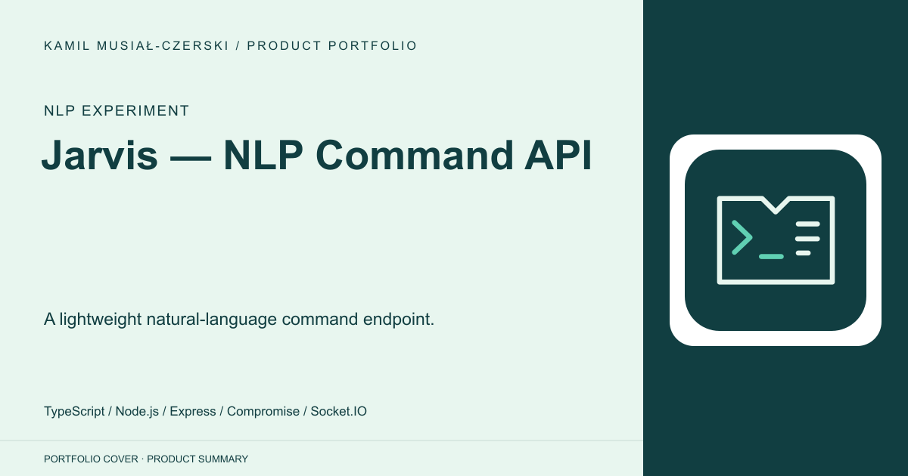
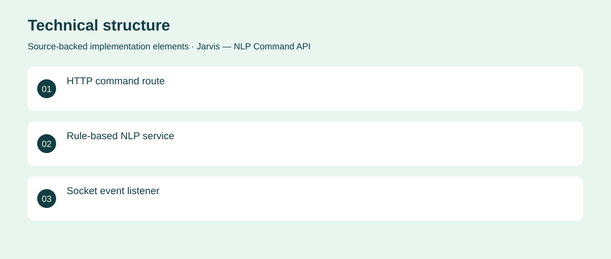

# Jarvis — NLP Command API

A lightweight natural-language command endpoint.

**NLP experiment · Archived proof of concept supporting a small set of rule-based phrases; no autonomous task execution verified.**

Explore a small conversational interface without relying on a hosted large language model.

An Express API applies Compromise NLP to simple commands and returns rule-based responses, with Socket.IO command reception alongside HTTP routes. Implemented the API structure, command service and socket event handler.

Archived proof of concept supporting a small set of rule-based phrases; no autonomous task execution verified.

## Problem

Explore a small conversational interface without relying on a hosted large language model.

## Solution

An Express API applies Compromise NLP to simple commands and returns rule-based responses, with Socket.IO command reception alongside HTTP routes.

## My contribution

Implemented the API structure, command service and socket event handler.

## Technology

TypeScript; Node.js; Express; Compromise; Socket.IO

## Technical structure

HTTP command route; Rule-based NLP service; Socket event listener

## AI capabilities

Rule-based natural-language command parsing

## Visuals

Portfolio cover and new project marks are editorial artwork. Only product views explicitly identified as captures represent screenshots.

[Complete portfolio](../README.md)
