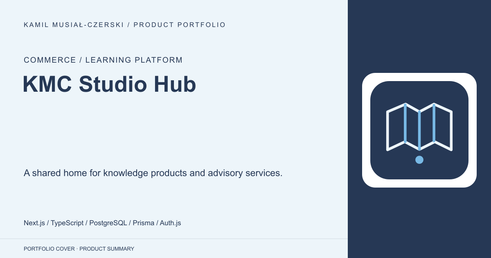
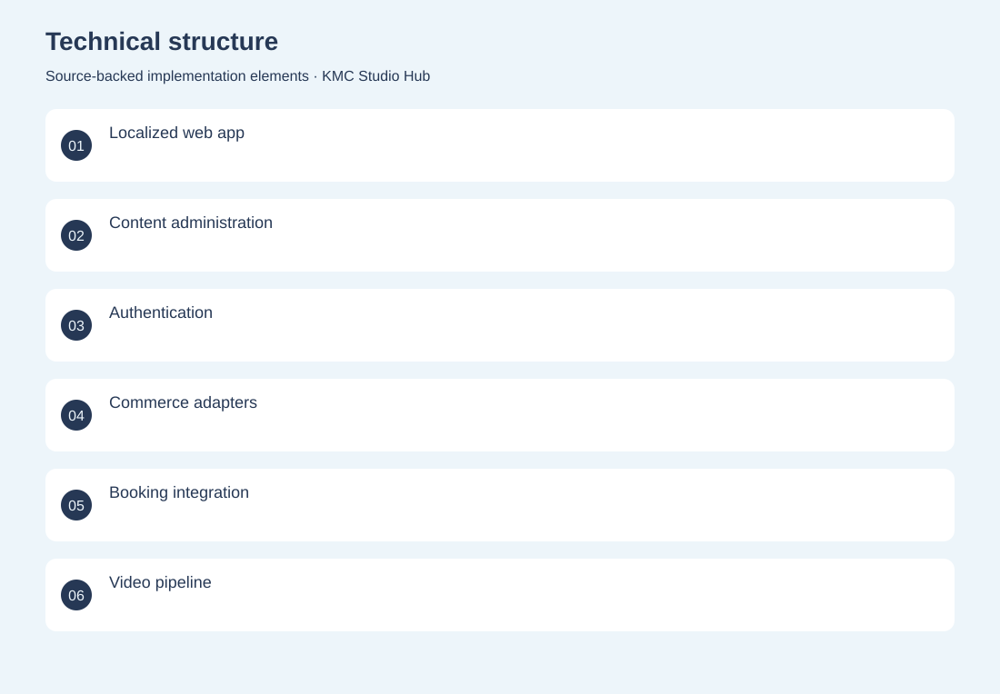
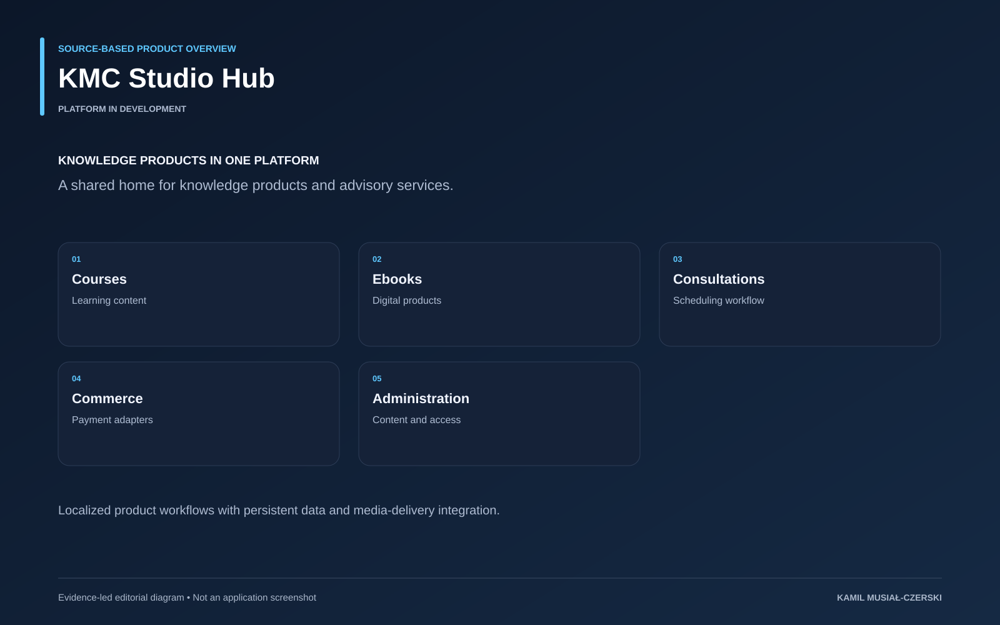

# KMC Studio Hub

A shared home for knowledge products and advisory services.

**Commerce / Learning platform · Platform in development**

The platform organizes knowledge products and advisory services around a shared account and administrative model. Localized Next.js pages connect course and ebook content to purchasing, consultation scheduling and media-delivery adapters. PostgreSQL and Prisma provide the persistent foundation, while integration boundaries keep external payment, invoicing and video services explicit.

## Problem

A knowledge business needs content, access, purchasing and scheduling to work coherently.

## Solution

A Next.js application brings together product content, authentication, transactional workflows and media infrastructure.

## My contribution

Implemented localized product and content workflows, administrative interfaces and integrations for commerce and media delivery.

## Technology

Next.js; TypeScript; PostgreSQL; Prisma; Auth.js; Tailwind CSS; Stripe; PayPal; MinIO

## Technical structure

Localized web app; Content administration; Authentication; Commerce adapters; Booking integration; Video pipeline

## Visuals

Portfolio cover and new project marks are editorial artwork. Only product views explicitly identified as captures represent screenshots.

[Complete portfolio](../README.md)

