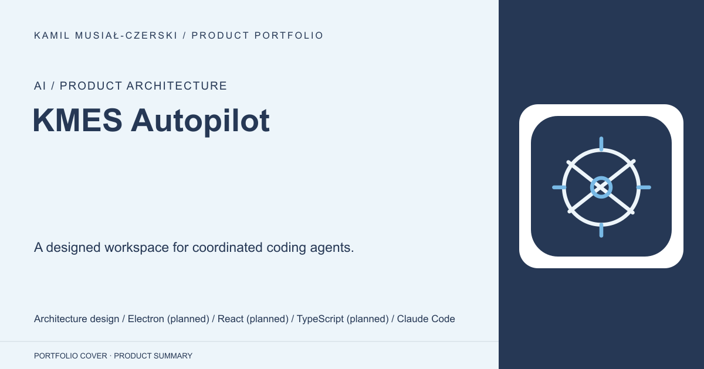
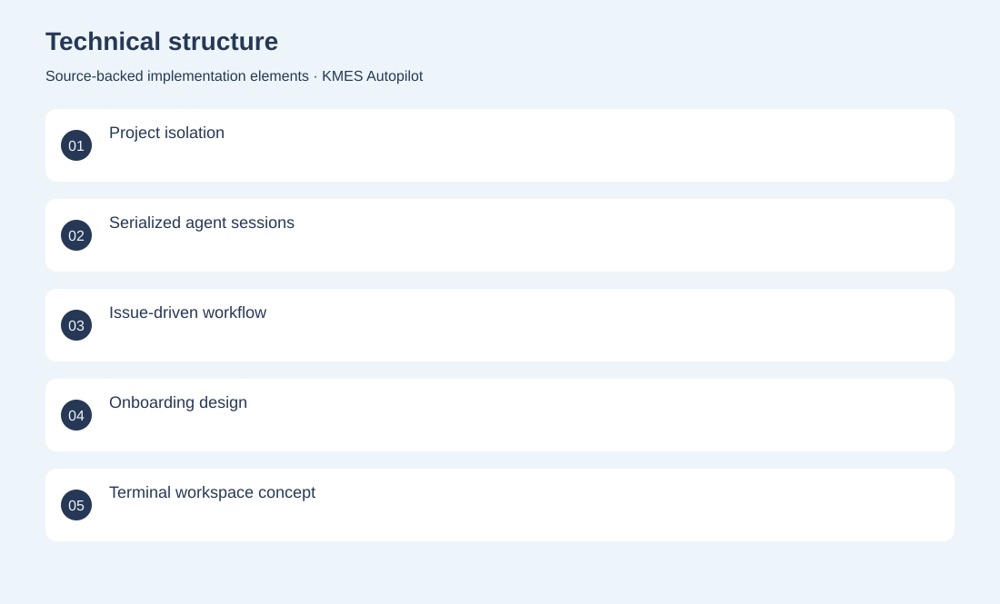
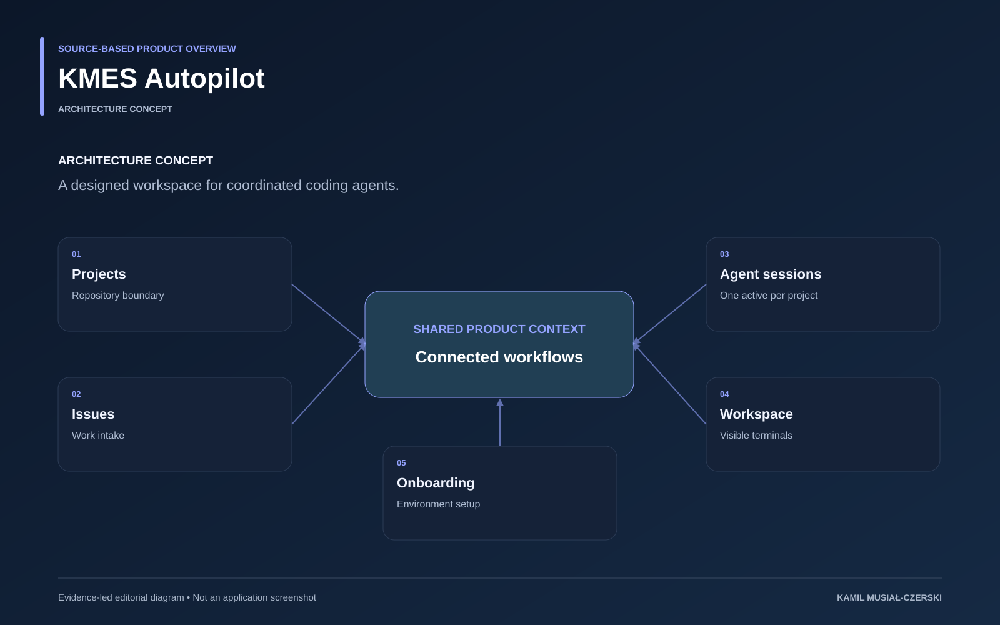

# KMES Autopilot

A designed workspace for coordinated coding agents.

**AI / Product architecture · Architecture concept**

A documented Electron-based concept describes per-project sessions, GitHub issue workflows and an embedded terminal workspace. Defined the domain model, issue-to-agent workflow, session serialization and desktop workspace architecture.

## Problem

Parallel coding agents need clear project boundaries and operational visibility.

## Solution

A documented Electron-based concept describes per-project sessions, GitHub issue workflows and an embedded terminal workspace.

## My contribution

Defined the domain model, issue-to-agent workflow, session serialization and desktop workspace architecture.

## Technology

Architecture design; Electron (planned); React (planned); TypeScript (planned); Claude Code

## Technical structure

Project isolation; Serialized agent sessions; Issue-driven workflow; Onboarding design; Terminal workspace concept

## AI capabilities

Coding-agent orchestration design

## Visuals

Portfolio cover and new project marks are editorial artwork. Only product views explicitly identified as captures represent screenshots.

[Complete portfolio](../README.md)

