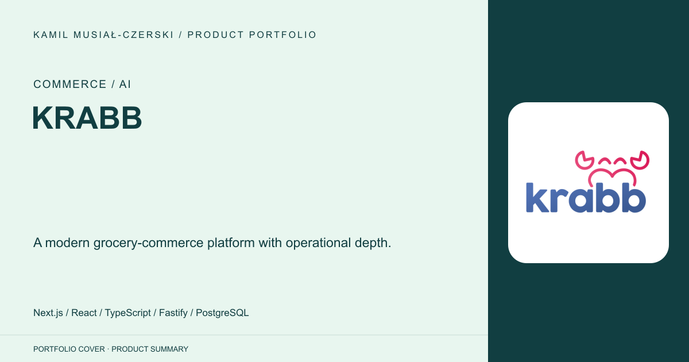
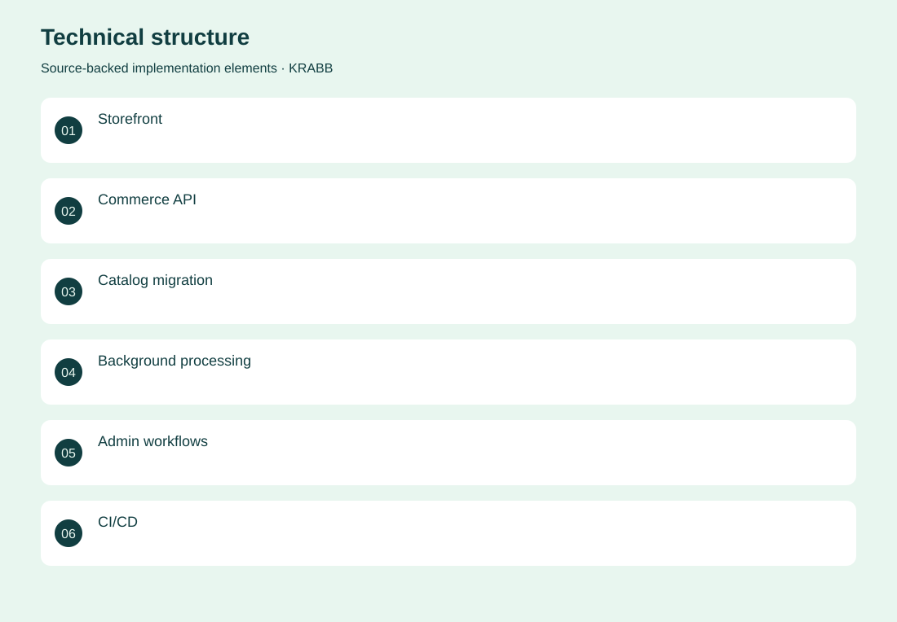
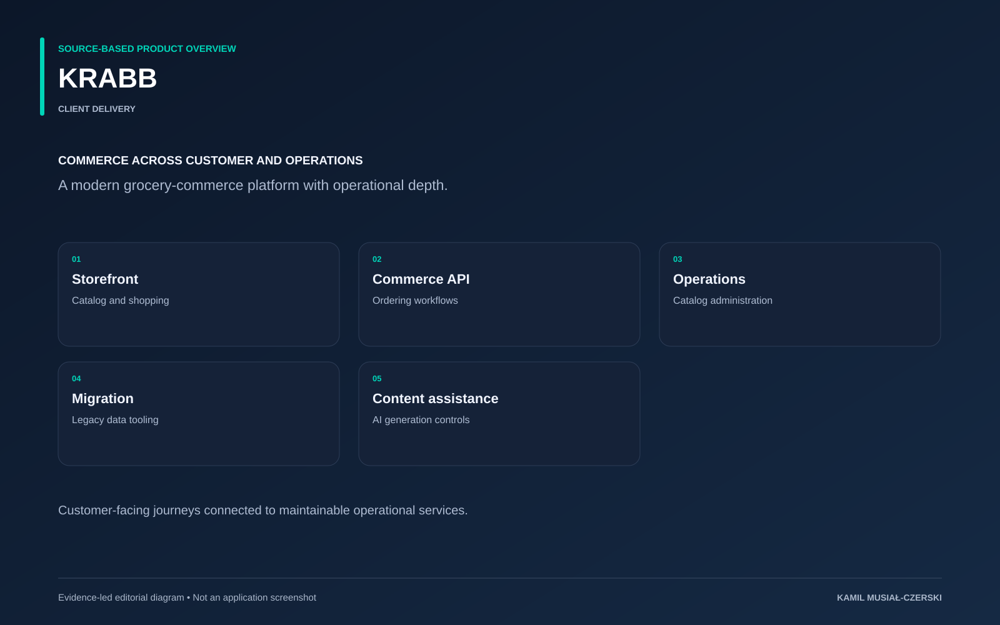

# KRABB

A modern grocery-commerce platform with operational depth.

**Commerce / AI · Client delivery**

The commerce rebuild separates the customer storefront, operational API and shared data model. Migration tooling carries catalog and legacy commerce data into the new structure, while background services support ongoing operations. Later delivery work tightened availability presentation, product descriptions and AI-output guards, with repository handoffs recording production verification.

## Problem

A growing grocery catalog requires consistent shopping flows, operational integrations and maintainable content.

## Solution

A Next.js storefront and Fastify API share database contracts, with background processing and deployment workflows.

## My contribution

Built storefront and API workflows, catalog migration tooling, operational integrations and guarded AI-content presentation.

## Technology

Next.js; React; TypeScript; Fastify; PostgreSQL; Prisma; Redis; Docker; Azure

## Technical structure

Storefront; Commerce API; Catalog migration; Background processing; Admin workflows; CI/CD

## AI capabilities

Assisted product-content generation; AI usage controls

## Visuals

Portfolio cover and new project marks are editorial artwork. Only product views explicitly identified as captures represent screenshots.

[Complete portfolio](../README.md)

