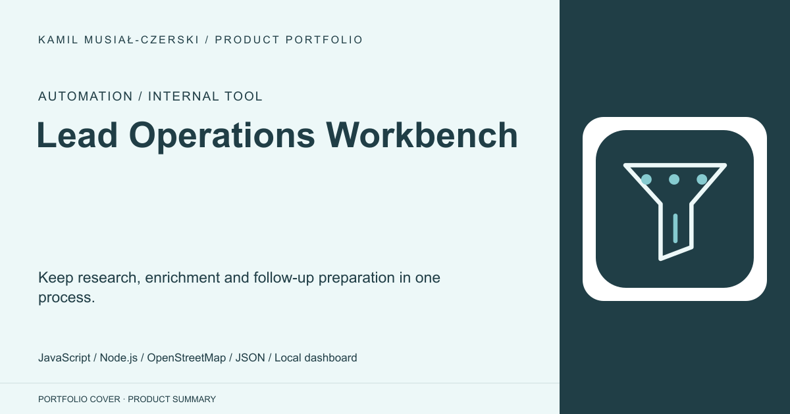
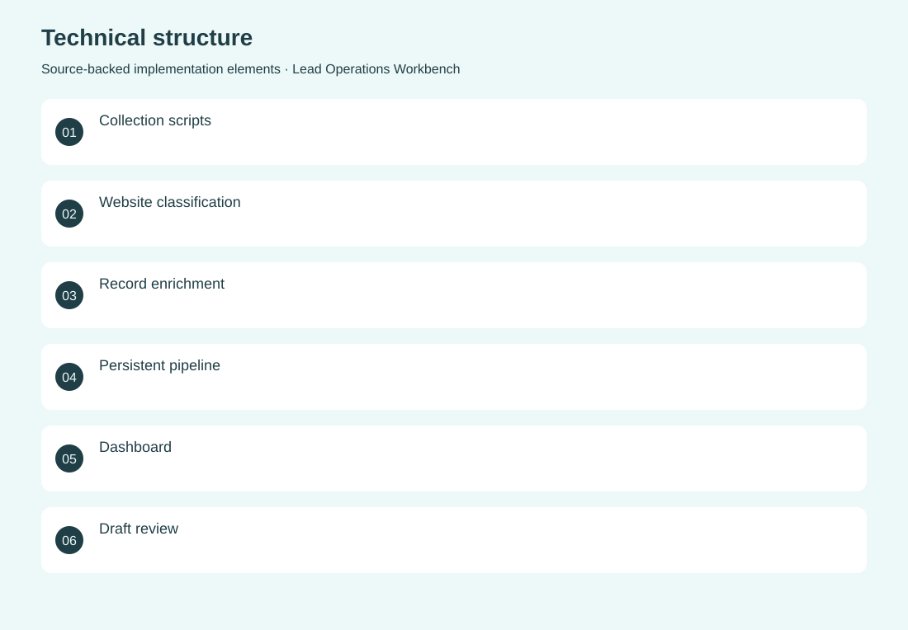
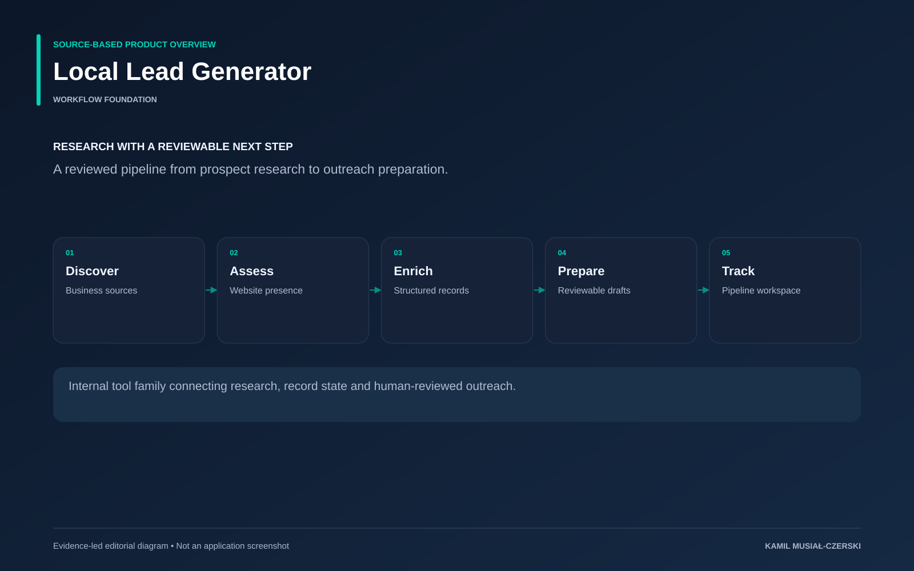

# Lead Operations Workbench

Keep research, enrichment and follow-up preparation in one process.

**Automation / Internal tool · Internal workflow tool**

Small reusable scripts share a persistent record store and expose progress through a local dashboard. Implemented shared pipeline state, collection and enrichment scripts, draft-review workflows and a local dashboard.

## Problem

Prospect research loses value when records and follow-up states are scattered.

## Solution

Small reusable scripts share a persistent record store and expose progress through a local dashboard.

## My contribution

Implemented shared pipeline state, collection and enrichment scripts, draft-review workflows and a local dashboard.

## Technology

JavaScript; Node.js; OpenStreetMap; JSON; Local dashboard; TypeScript; SQLite; Drizzle; Playwright; CSV

## Technical structure

Collection scripts; Website classification; Record enrichment; Persistent pipeline; Dashboard; Draft review; CLI; Campaign data model; Email queue; Templates; Unsubscribe endpoint; Background worker; Browser collection; Deduplication; Enrichment; CSV export; Messaging templates

## AI capabilities

Agent-assisted draft preparation

## Visuals

Portfolio cover and new project marks are editorial artwork. Only product views explicitly identified as captures represent screenshots.

[Complete portfolio](../README.md)

