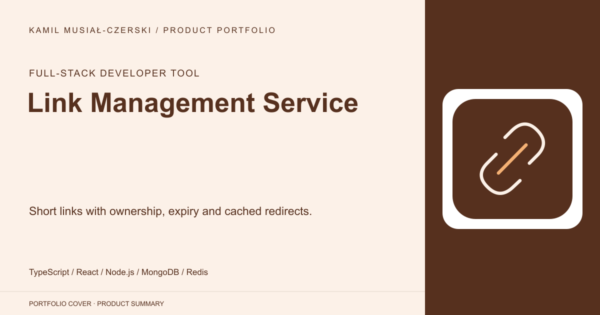
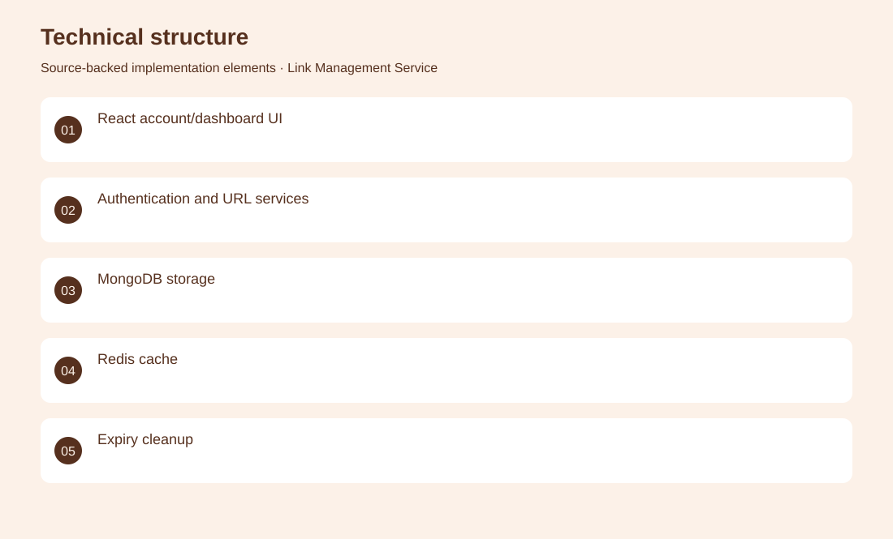
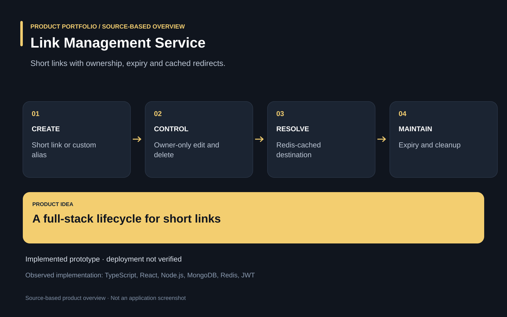

# Link Management Service

Short links with ownership, expiry and cached redirects.

**Full-stack developer tool · Implemented prototype; public deployment, load capacity and production security have not been verified in this review.**

Managing short links requires more than generating an alias: owners need control, expiration and visibility into use.

A full-stack application connects authenticated link management with MongoDB persistence, Redis caching, custom aliases and expiry handling. Implemented URL services, ownership checks, cache invalidation, frontend account pages and dashboard interactions.

Implemented prototype; public deployment, load capacity and production security have not been verified in this review.

## Problem

Managing short links requires more than generating an alias: owners need control, expiration and visibility into use.

## Solution

A full-stack application connects authenticated link management with MongoDB persistence, Redis caching, custom aliases and expiry handling.

## My contribution

Implemented URL services, ownership checks, cache invalidation, frontend account pages and dashboard interactions.

## Technology

TypeScript; React; Node.js; MongoDB; Redis; JWT

## Technical structure

React account/dashboard UI; Authentication and URL services; MongoDB storage; Redis cache; Expiry cleanup

## Visuals

Portfolio cover and new project marks are editorial artwork. Only product views explicitly identified as captures represent screenshots.

[Complete portfolio](../README.md)

