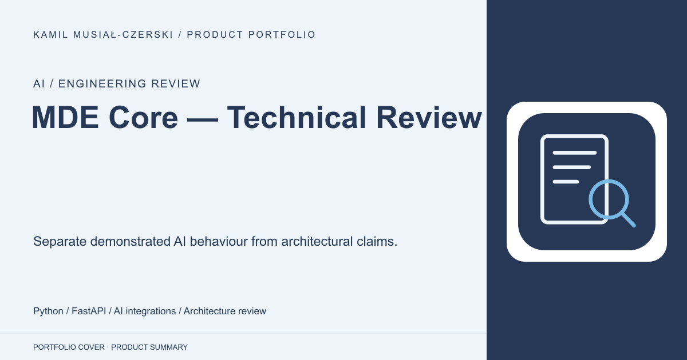
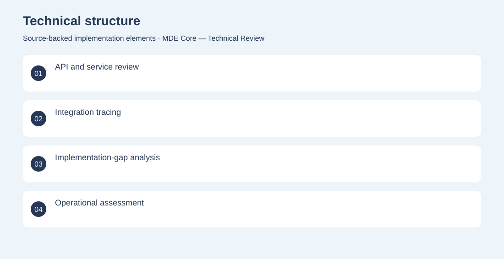
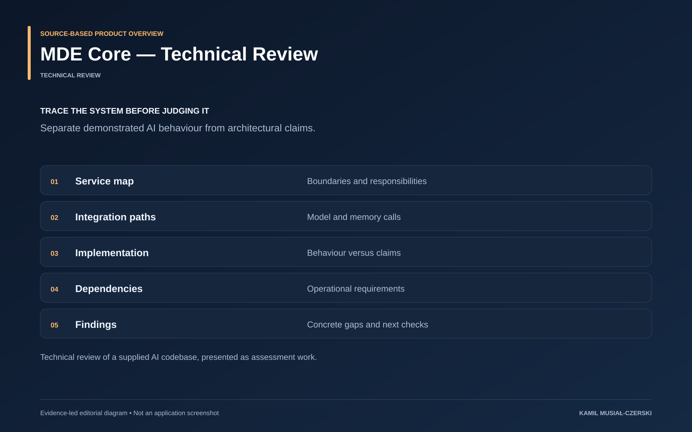

# MDE Core — Technical Review

Separate demonstrated AI behaviour from architectural claims.

**AI / Engineering review · Technical review**

A code-level assessment identifies implemented integrations, operational dependencies and gaps requiring validation. Reviewed service boundaries, traced AI integrations and documented gaps between specifications and implemented behaviour.

## Problem

Complex AI systems can accumulate claims and abstractions that exceed demonstrated behaviour.

## Solution

A code-level assessment identifies implemented integrations, operational dependencies and gaps requiring validation.

## My contribution

Reviewed service boundaries, traced AI integrations and documented gaps between specifications and implemented behaviour.

## Technology

Python; FastAPI; AI integrations; Architecture review

## Technical structure

API and service review; Integration tracing; Implementation-gap analysis; Operational assessment

## AI capabilities

Review of conversational AI and memory integration

## Visuals

Portfolio cover and new project marks are editorial artwork. Only product views explicitly identified as captures represent screenshots.

[Complete portfolio](../README.md)

