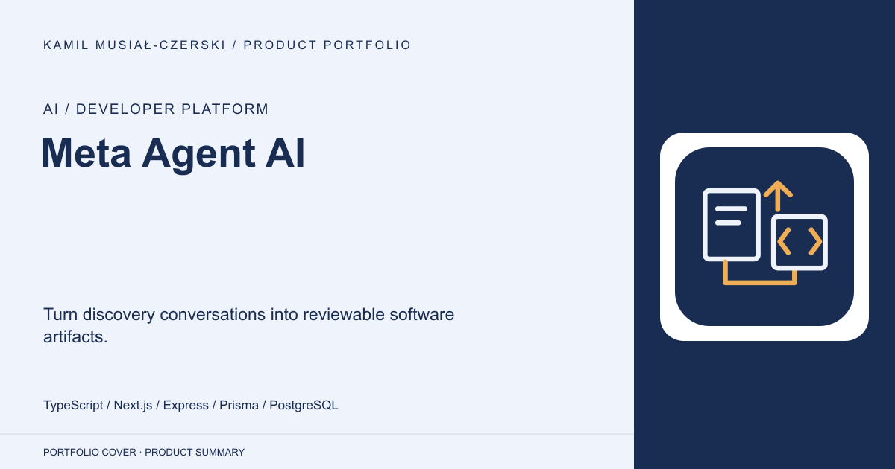
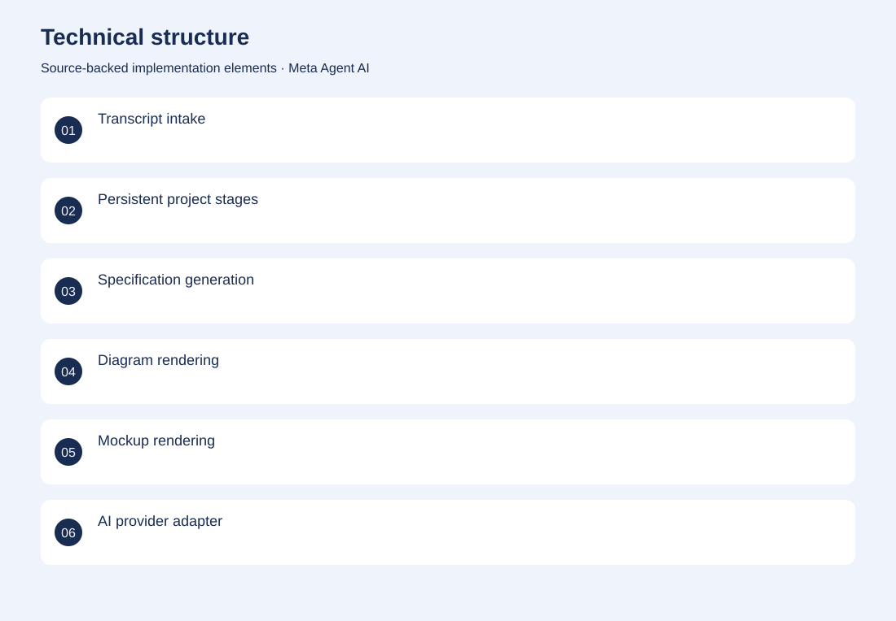
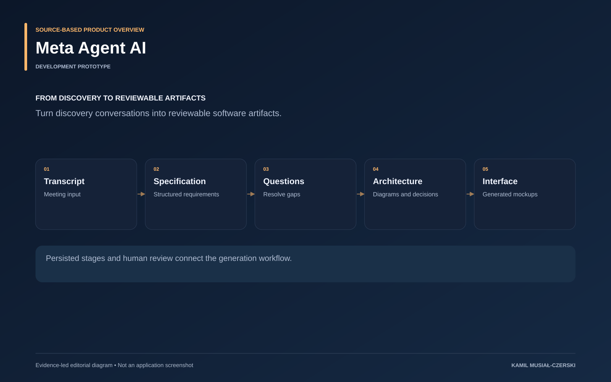

# Meta Agent AI

Turn discovery conversations into reviewable software artifacts.

**AI / Developer platform · Development prototype**

A project progresses through persisted stages from transcript to specification, questions, diagrams and interface artifacts. Model integrations are separated from the web workspace, and generated results remain visible and editable. This makes discovery-to-implementation work reviewable while allowing individual stages to be revisited.

## Problem

The gap between a discovery meeting and an implementable specification is often inconsistent and manual.

## Solution

Persisted project stages and human approval connect transcript processing with artifact generation and local model integrations.

## My contribution

Connected transcript intake, persistent project stages and human-reviewed generation of specifications, diagrams and mockups.

## Technology

TypeScript; Next.js; Express; Prisma; PostgreSQL; Ollama

## Technical structure

Transcript intake; Persistent project stages; Specification generation; Diagram rendering; Mockup rendering; AI provider adapter

## AI capabilities

Specification generation; Gap detection; Diagram and UI generation; Code-generation workflow

## Visuals

Portfolio cover and new project marks are editorial artwork. Only product views explicitly identified as captures represent screenshots.

[Complete portfolio](../README.md)

