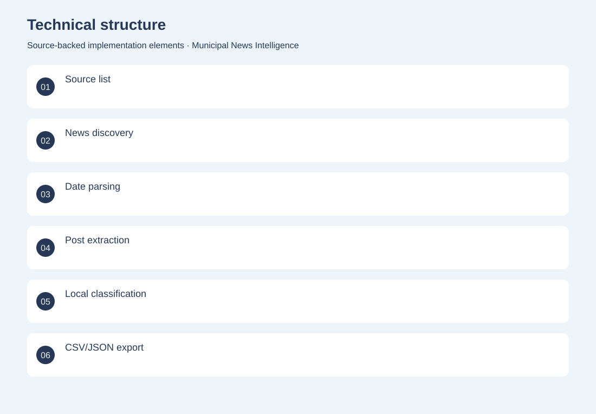
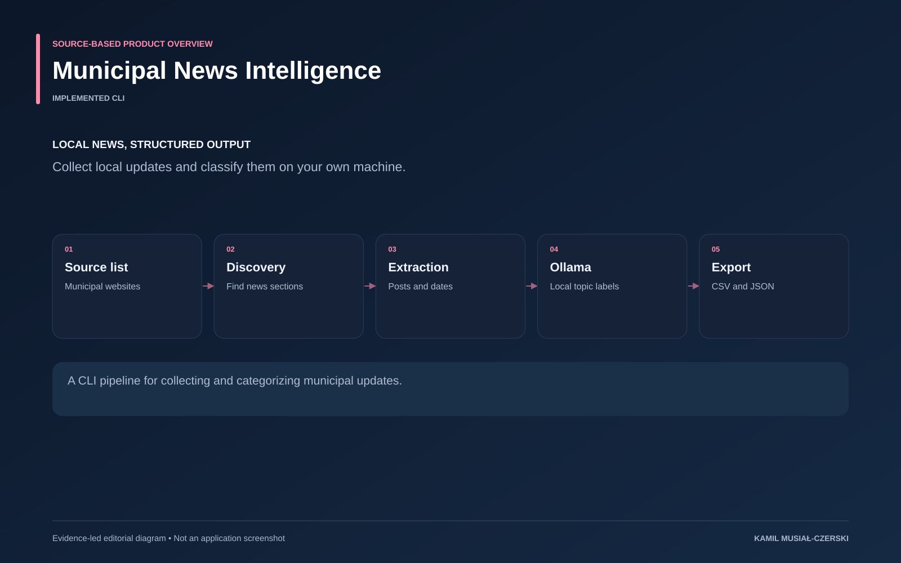

# Municipal News Intelligence

Collect local updates and classify them on your own machine.

**AI / Data pipeline · Implemented CLI**

Concurrent fetching and extraction feed a local language-model categorizer and reusable CSV/JSON outputs. Implemented municipal news discovery, date and content extraction, local topic classification and structured exports.

## Problem

Local news relevant to grants, procurement and investment is distributed across many municipal sites.

## Solution

Concurrent fetching and extraction feed a local language-model categorizer and reusable CSV/JSON outputs.

## My contribution

Implemented municipal news discovery, date and content extraction, local topic classification and structured exports.

## Technology

Python; HTTPX; BeautifulSoup; Ollama

## Technical structure

Source list; News discovery; Date parsing; Post extraction; Local classification; CSV/JSON export

## AI capabilities

Local topic classification

## Visuals

Portfolio cover and new project marks are editorial artwork. Only product views explicitly identified as captures represent screenshots.

[Complete portfolio](../README.md)

