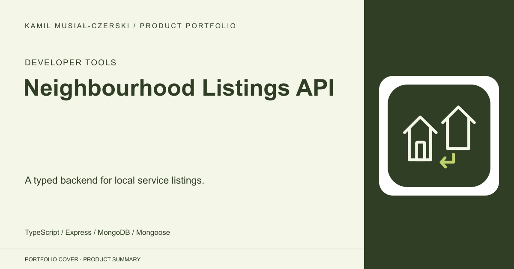
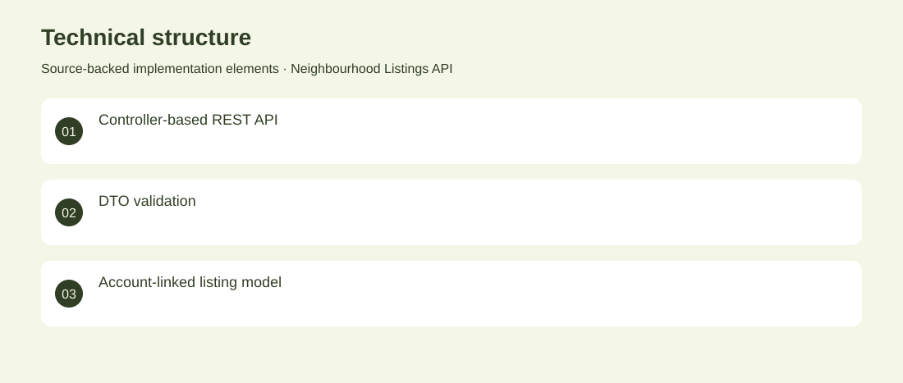

# Neighbourhood Listings API

A typed backend for local service listings.

**Developer Tools · Archived backend prototype**

An early Express and MongoDB backend for publishing local listings with descriptions, prices, location information and completion states. Implemented listing CRUD, user associations, input validation and authentication middleware. Archived backend prototype. No adoption, revenue or deployment claims are inferred from the repository.

## Problem

Local service listings need a consistent data model and account-aware publishing.

## Solution

Implemented listing CRUD, user associations, input validation and authentication middleware.

## My contribution

Backend implementation covering typed controllers, persistence models and account flows.

## Technology

TypeScript; Express; MongoDB; Mongoose

## Technical structure

Controller-based REST API; DTO validation; Account-linked listing model

## Visuals

Portfolio cover and new project marks are editorial artwork. Only product views explicitly identified as captures represent screenshots.

[Complete portfolio](../README.md)
