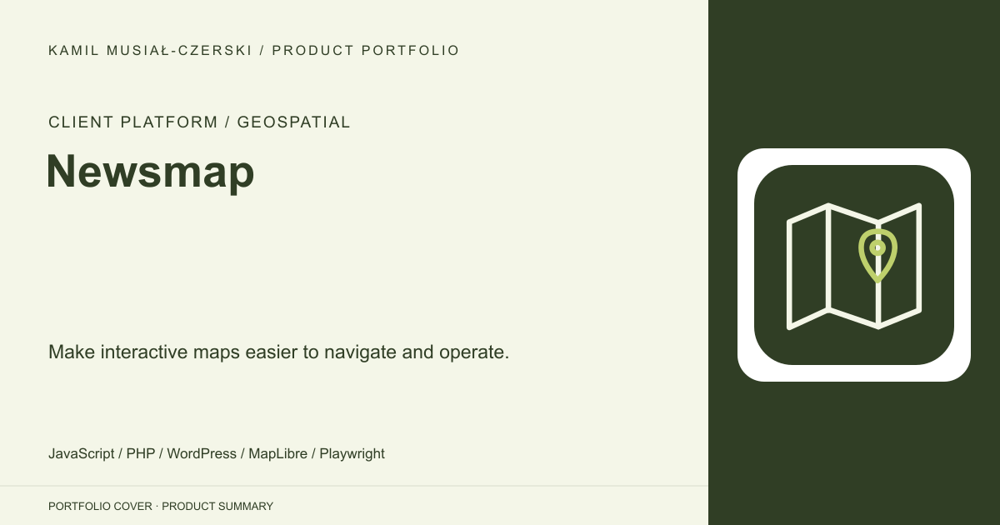
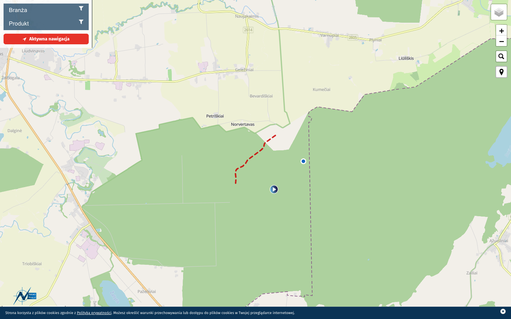
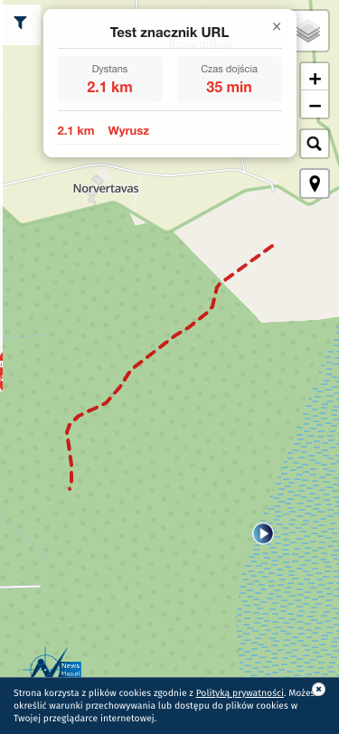
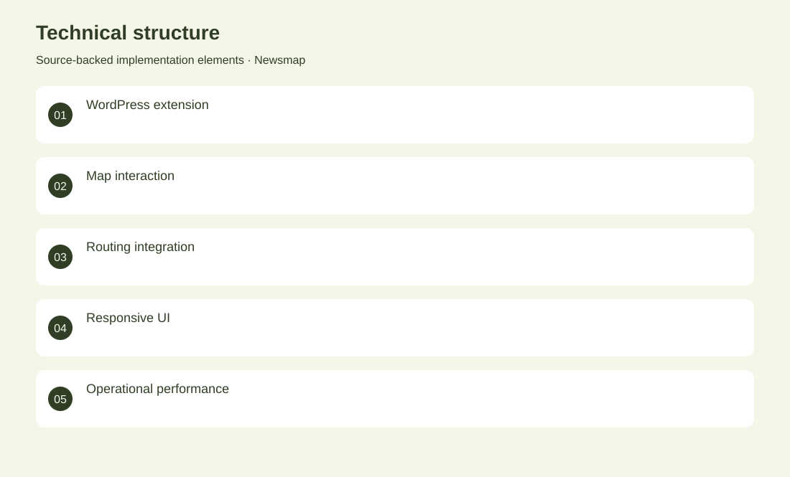

# Newsmap

Make interactive maps easier to navigate and operate.

**Client platform / Geospatial · Client delivery**

The work extends an existing map product through targeted integration changes. Navigation controls connect map markers to route presentation, with desktop and mobile behavior covered by saved browser-verification captures. PHP hooks and JavaScript interactions are complemented by operational performance work around the WordPress delivery stack.

## Problem

Map users need reliable navigation controls across devices, while operators need predictable service behaviour.

## Solution

Custom JavaScript and WordPress integration connect map interactions to routing, supported by direct browser verification artifacts.

## My contribution

Implemented map-navigation controls, responsive interaction fixes and browser-verified WordPress integration changes.

## Technology

JavaScript; PHP; WordPress; MapLibre; Playwright; Nginx

## Technical structure

WordPress extension; Map interaction; Routing integration; Responsive UI; Operational performance

## Visuals

Portfolio cover and new project marks are editorial artwork. Only product views explicitly identified as captures represent screenshots.

[Complete portfolio](../README.md)
