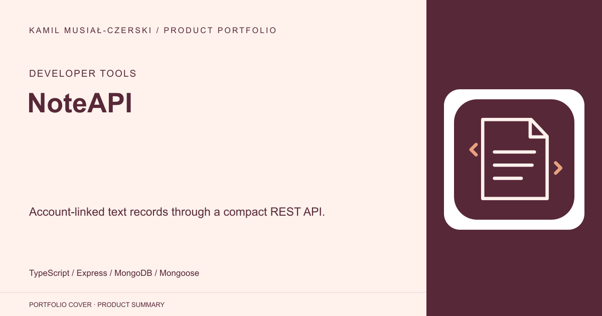
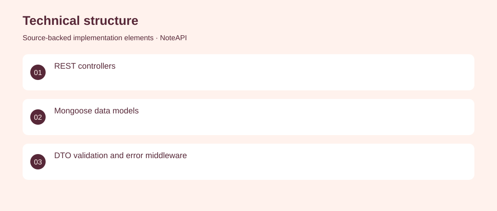

# NoteAPI

Account-linked text records through a compact REST API.

**Developer Tools · Archived API prototype**

A TypeScript API for creating, reading, updating and deleting titled text records. The implementation calls these records reviews and associates them with user accounts. Implemented MongoDB-backed records, authentication, validation and controller-level error handling. Archived API prototype. No adoption, revenue or deployment claims are inferred from the repository.

## Problem

Small applications need reusable text-record persistence and predictable API errors.

## Solution

Implemented MongoDB-backed records, authentication, validation and controller-level error handling.

## My contribution

REST API implementation and typed data models for users and text records.

## Technology

TypeScript; Express; MongoDB; Mongoose

## Technical structure

REST controllers; Mongoose data models; DTO validation and error middleware

## Visuals

Portfolio cover and new project marks are editorial artwork. Only product views explicitly identified as captures represent screenshots.

[Complete portfolio](../README.md)
