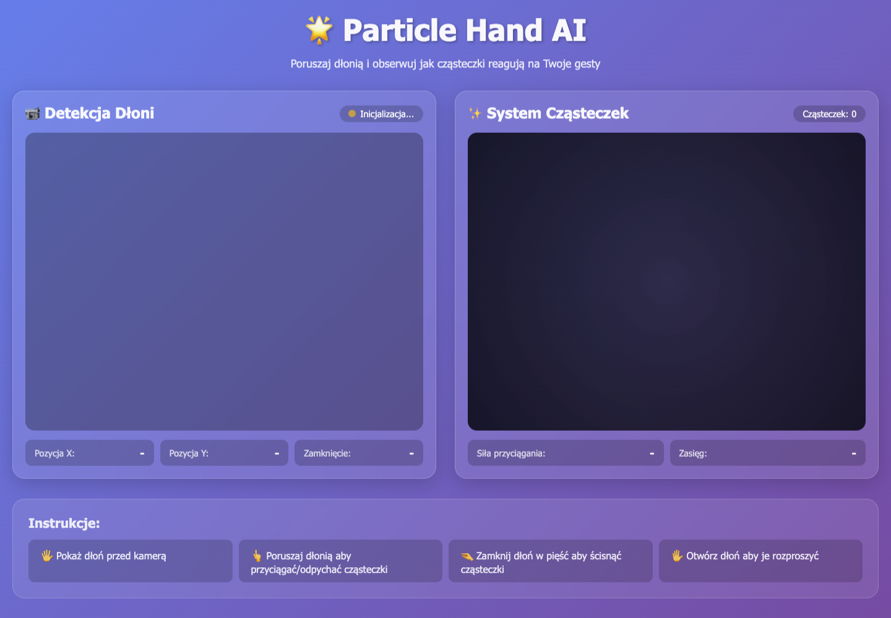
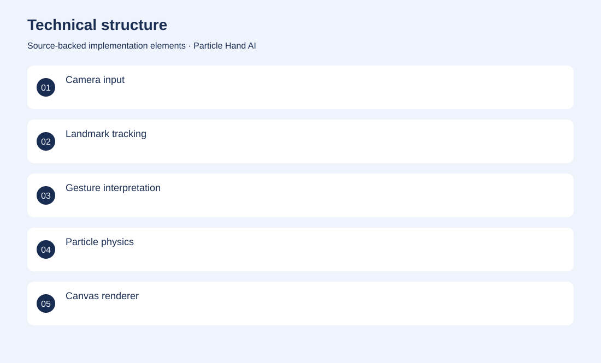
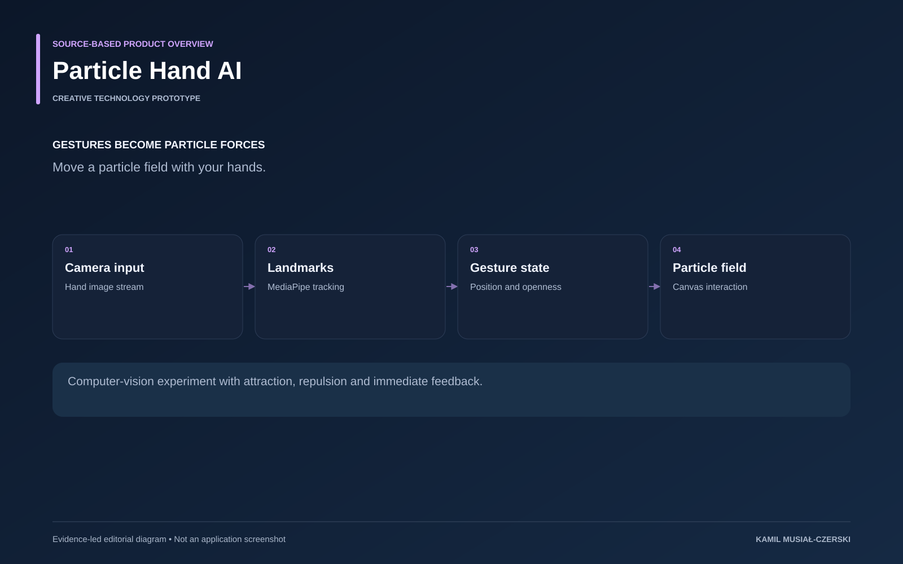

# Particle Hand AI

Move a particle field with your hands.

**Creative technology / Computer vision · Creative technology prototype**

MediaPipe hand tracking translates landmark positions and gestures into particle-system forces. Connected hand landmarks and gesture interpretation to particle forces and canvas rendering.

## Problem

Gesture interfaces need immediate visual feedback to make interaction understandable.

## Solution

MediaPipe hand tracking translates landmark positions and gestures into particle-system forces.

## My contribution

Connected hand landmarks and gesture interpretation to particle forces and canvas rendering.

## Technology

JavaScript; MediaPipe Hands; Canvas API; Node.js; Express

## Technical structure

Camera input; Landmark tracking; Gesture interpretation; Particle physics; Canvas renderer

## AI capabilities

Real-time hand tracking

## Visuals

Portfolio cover and new project marks are editorial artwork. Only product views explicitly identified as captures represent screenshots.

[Complete portfolio](../README.md)

