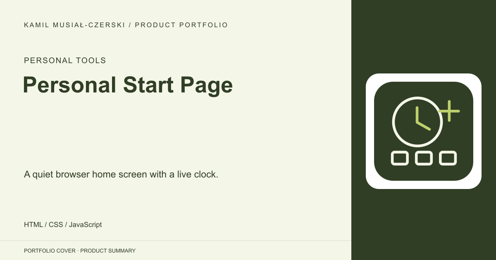
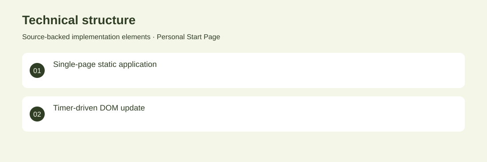

# Personal Start Page

A quiet browser home screen with a live clock.

**Personal Tools · Archived personal utility**

A compact, custom browser start page combining a personal greeting, a live clock and a distraction-free dark interface. Built a dependency-free page that updates the current time every second. Archived personal utility. No adoption, revenue or deployment claims are inferred from the repository.

## Problem

A browser homepage can be useful without feeds, advertising or visual noise.

## Solution

Built a dependency-free page that updates the current time every second.

## My contribution

HTML, CSS and browser-side clock implementation.

## Technology

HTML; CSS; JavaScript

## Technical structure

Single-page static application; Timer-driven DOM update

## Visuals

Portfolio cover and new project marks are editorial artwork. Only product views explicitly identified as captures represent screenshots.

[Complete portfolio](../README.md)
