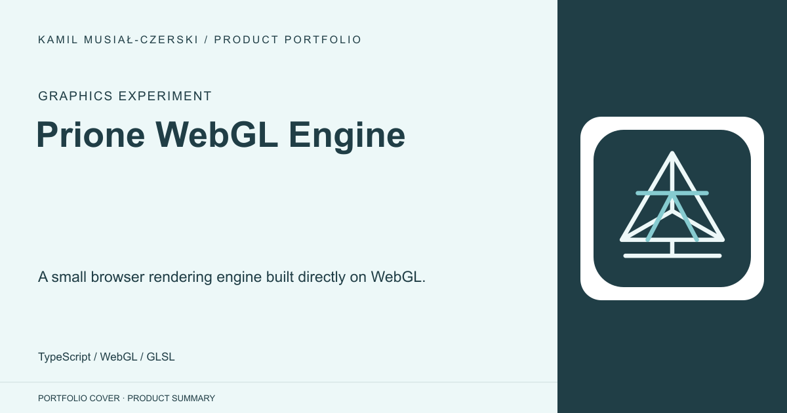
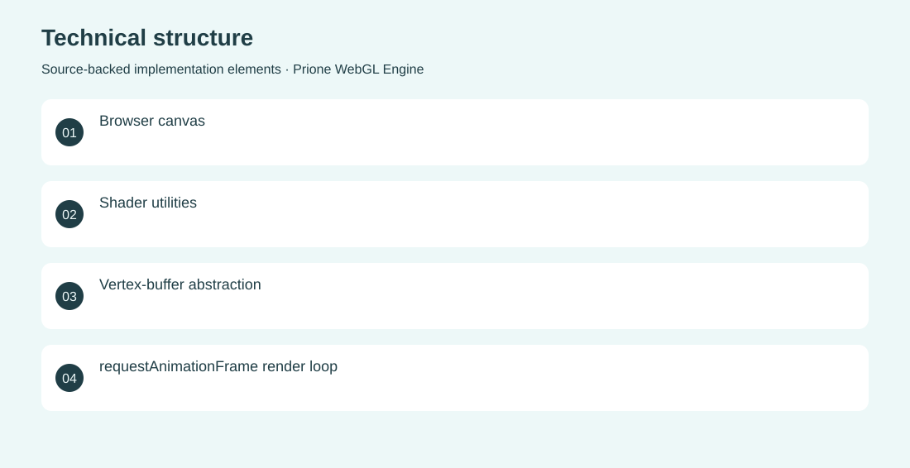

# Prione WebGL Engine

A small browser rendering engine built directly on WebGL.

**Graphics experiment · Archived technical experiment; not a complete game engine.**

Explore the rendering primitives behind interactive browser graphics.

A TypeScript engine initializes WebGL, compiles shaders, manages vertex buffers and uniforms, and drives a responsive animation loop. Implemented the engine structure, shader and buffer utilities, and a triangle-rendering demonstration.

Archived technical experiment; not a complete game engine.

## Problem

Explore the rendering primitives behind interactive browser graphics.

## Solution

A TypeScript engine initializes WebGL, compiles shaders, manages vertex buffers and uniforms, and drives a responsive animation loop.

## My contribution

Implemented the engine structure, shader and buffer utilities, and a triangle-rendering demonstration.

## Technology

TypeScript; WebGL; GLSL

## Technical structure

Browser canvas; Shader utilities; Vertex-buffer abstraction; requestAnimationFrame render loop

## Visuals

Portfolio cover and new project marks are editorial artwork. Only product views explicitly identified as captures represent screenshots.

[Complete portfolio](../README.md)
