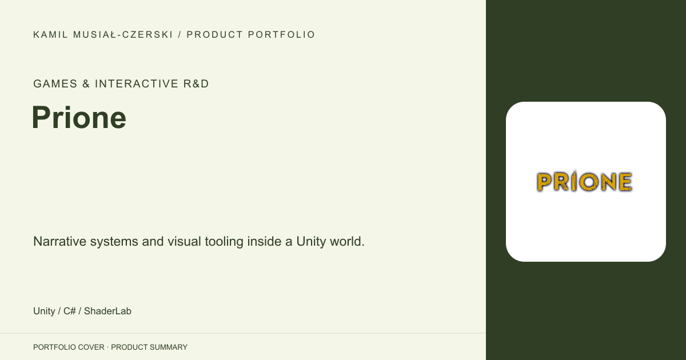
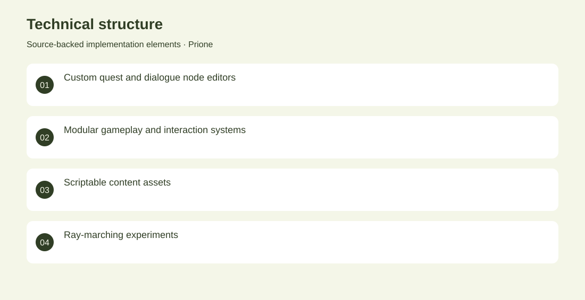

# Prione

Narrative systems and visual tooling inside a Unity world.

**Games & Interactive R&D · Archived game prototype**

A Unity game prototype with custom quest and dialogue editors, inventory, interaction, movement and scene-management systems. The repository also explores ray-marched higher-dimensional forms. Built node-based editor tooling alongside modular gameplay systems and experimental visual rendering. Archived game prototype. No adoption, revenue or deployment claims are inferred from the repository.

## Problem

Interactive narrative requires both runtime systems for players and authoring tools for creating interconnected content.

## Solution

Built node-based editor tooling alongside modular gameplay systems and experimental visual rendering.

## My contribution

Game-systems engineering and editor-tool development; third-party environment assets remain distinct from authored code.

## Technology

Unity; C#; ShaderLab

## Technical structure

Custom quest and dialogue node editors; Modular gameplay and interaction systems; Scriptable content assets; Ray-marching experiments

## Visuals

Portfolio cover and new project marks are editorial artwork. Only product views explicitly identified as captures represent screenshots.

[Complete portfolio](../README.md)
