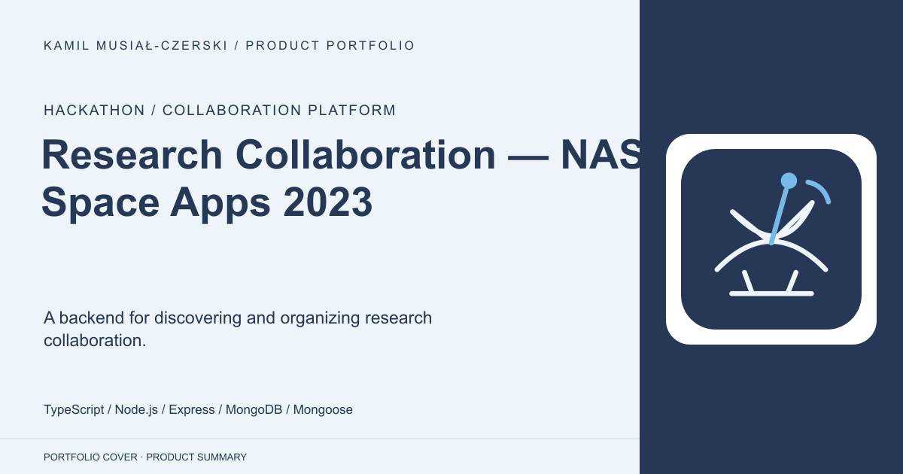
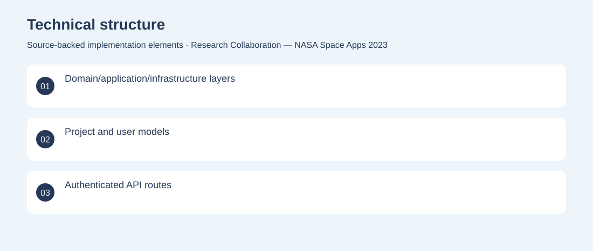
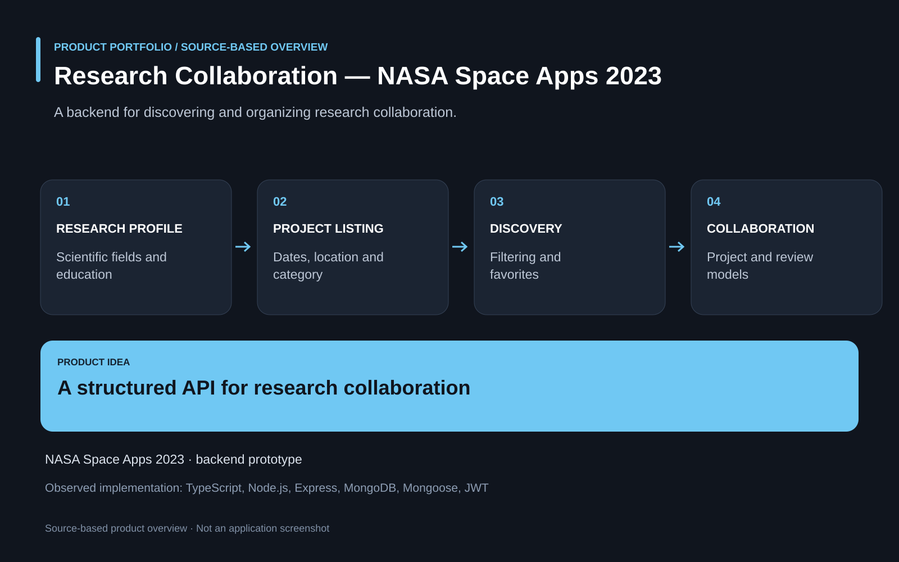

# Research Collaboration — NASA Space Apps 2023

A backend for discovering and organizing research collaboration.

**Hackathon / collaboration platform · Archived NASA Space Apps 2023 backend prototype; frontend and public deployment not verified in this repository.**

Research collaboration requires structured project listings and information about participants and disciplines.

A TypeScript API models projects, user profiles, scientific fields and reviews, with project filtering, creation and favorites. Developed backend domain models, project services, user routes and authentication middleware for the hackathon prototype.

Archived NASA Space Apps 2023 backend prototype; frontend and public deployment not verified in this repository.

## Problem

Research collaboration requires structured project listings and information about participants and disciplines.

## Solution

A TypeScript API models projects, user profiles, scientific fields and reviews, with project filtering, creation and favorites.

## My contribution

Developed backend domain models, project services, user routes and authentication middleware for the hackathon prototype.

## Technology

TypeScript; Node.js; Express; MongoDB; Mongoose; JWT

## Technical structure

Domain/application/infrastructure layers; Project and user models; Authenticated API routes

## Visuals

Portfolio cover and new project marks are editorial artwork. Only product views explicitly identified as captures represent screenshots.

[Complete portfolio](../README.md)

